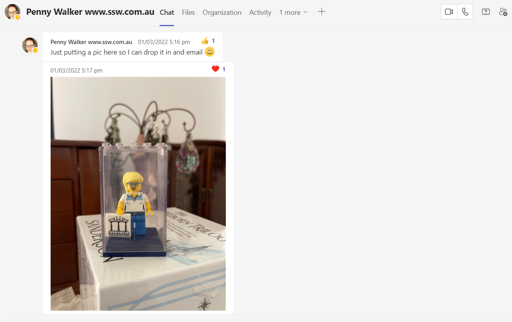
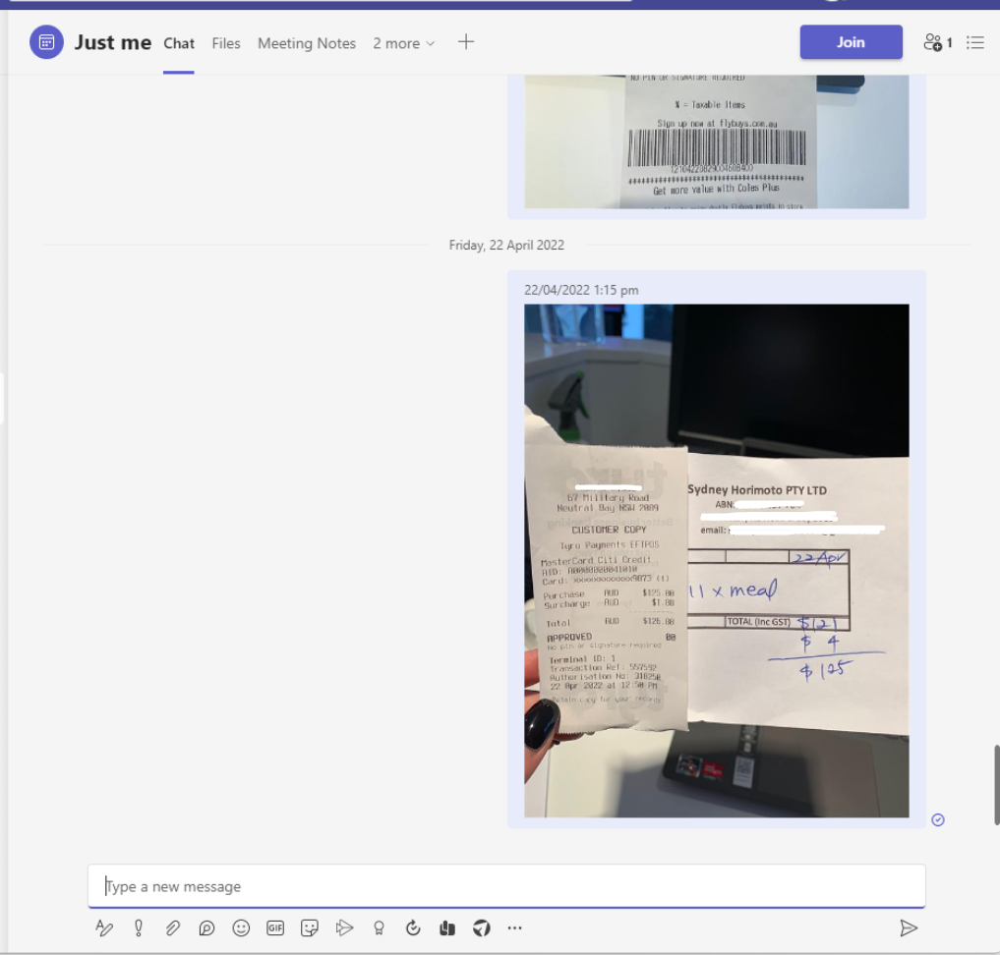

If often you see yourself trying to find an easy way to share an image or a note from your mobile to your laptop, this is a quick and easy tip to help you do this through Microsoft Teams. 

<!--endintro-->

Here are the steps to send a message to yourself on Teams: 

1. Schedule a meeting with just yourself and give it a title like “Just me” or anything similar that is obvious to you. 
2. Open the meeting request like any other meeting on Teams. 
3. Open the chat feature and write yourself a “test” message. 
4. You should see a new conversation next to all your other groups and private chats. 
5. Pin it, and now you have a wall for your thoughts. 💭🧱

:::: bad

::::

:::: good

::::