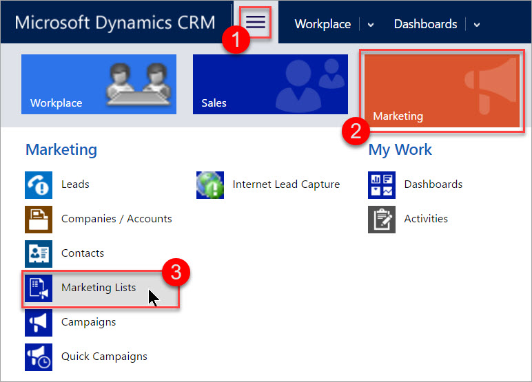
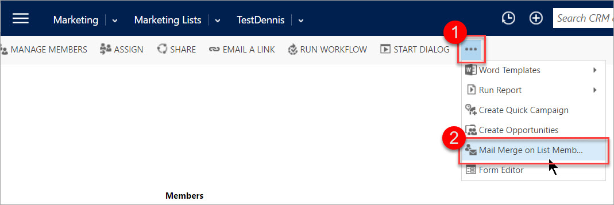
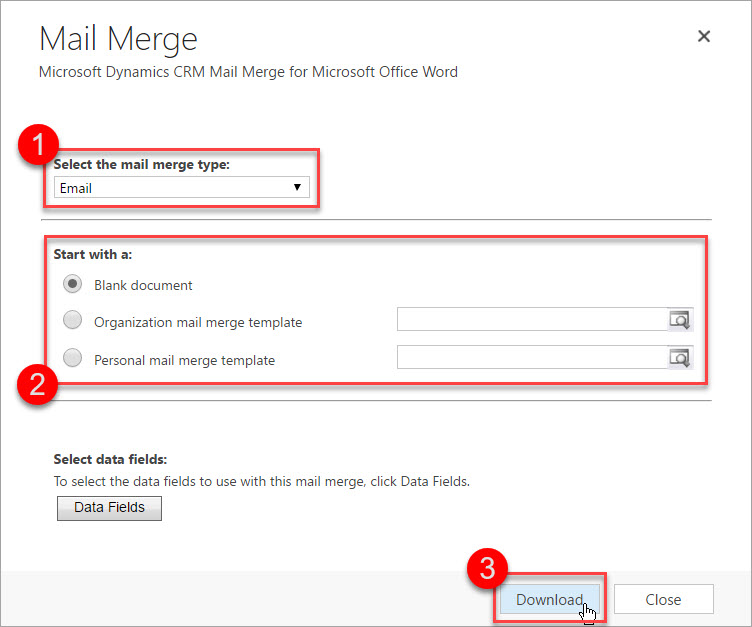
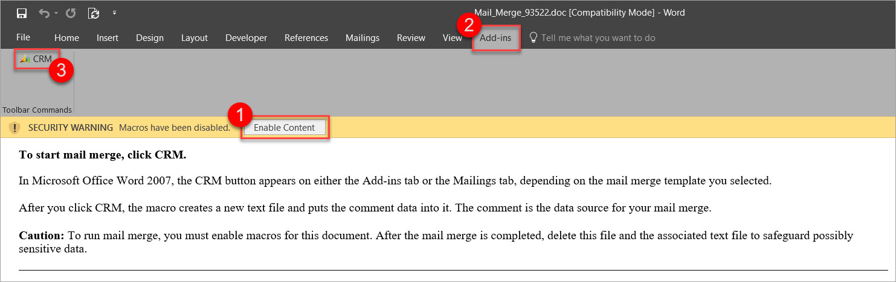
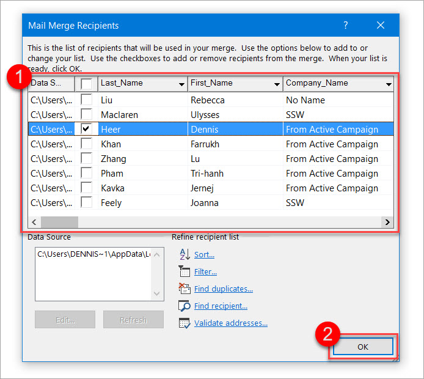
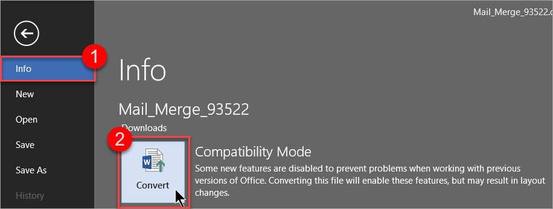
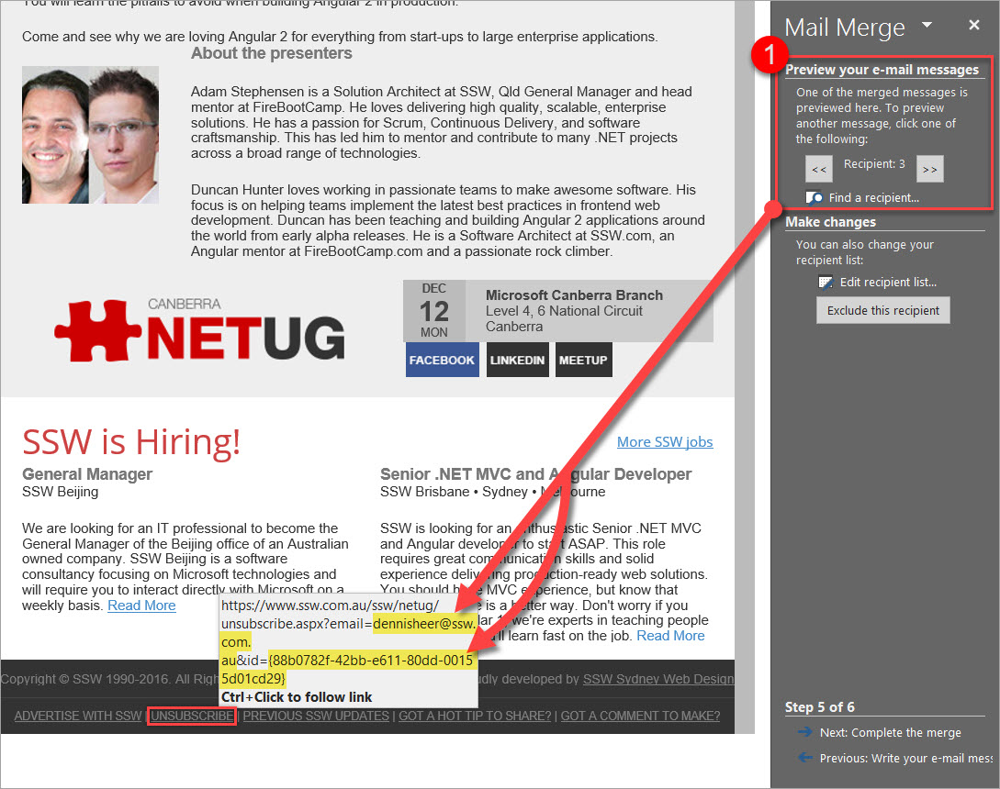
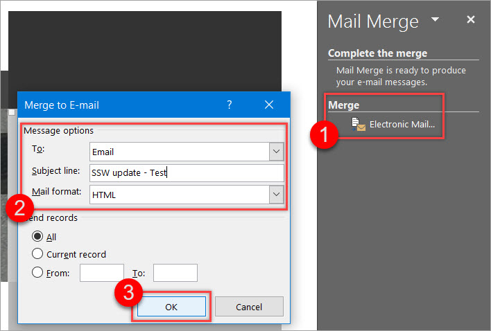

There are different ways of sending newsletters using the Microsoft Dynamics CRM 2016:

* Campaigns
* Quick Campaigns
* Mail Merge on Marketing Lists

This rule will show you how to send a newsletter using the last method, the mail merge.

By default, Microsoft Dynamics CRM 2016 does not come with good functionality on inserting custom unsubscribe links to your newsletters - that's why we are going to look at how to add a custom unsubscribe link in each email. 

<!--endintro-->

Prerequisites:

* [Microsoft Dynamics CRM 2016 for Microsoft Office Outlook (Outlook client)](https://www.microsoft.com/en-au/download/details.aspx?id=50370) is installed and set up
* Microsoft Outlook is running and set up

### Option 1 (recommended)

Basic coding knowledge (VBA) required - you will have to configure the macro that generates and inserts your custom unsubscribe link. If you don't feel comfortable doing this, have a look at Option 2 below.

Depending on how many contacts you are going to send the newsletter to, you should think about setting up a VM or using an external provider for sending the emails.

1. Go to **Main | Marketing | Marketing Lists**

   
2. Open the Marketing List you want to send the newsletter to by clicking on it (you should be using a dynamic list)
3. Go to **... | Mail Merge on List Members** (in the menu bar)

   
4. Select Email as the mail merge type, choose your starting document, (optional) select data fields to use, and download the .docx

   
5. Open the document in Word and follow the instructions in the document to start the Mail Merge

   
6. Exclude contacts and press **OK**

   
7. Copy and paste your newsletter from Internet Explorer to Word (IE because it seems to not break the style)

   For a nicer editing experience (especially with HTML newsletter), switch to the Web Layout view by clicking  **View | (Views) | Web Layout** in the ribbon bar.
8. If necessary, go to  **File | (Info) | Convert** to update the Word document to the newest version - this will solve styling issues while not breaking the mail merge

   
9. Modify and run the following macro to replace the word "UNSUBSCRIBE" in the newsletter with a custom hyperlink.

   For help on adding a macro to Word see the [Microsoft Office Support website](https://support.office.com/en-us/article/Create-or-run-a-macro-c6b99036-905c-49a6-818a-dfb98b7c3c9c).

```vbnet
Sub InsertNewsletterLink()
'
' InsertNewsletterLink Macro
'
'
'Finds and adds a hyperlink where the UNSUBSCRIBE tag is placed
    With Selection.Find
        .Forward = False
        .Wrap = wdFindAsk
        .Text = "UNSUBSCRIBE"
        .MatchWholeWord = True
        .Execute
    End With
    ActiveDocument.Fields.Add Range:=Selection.Range, Type:=wdFieldHyperlink
    
'Switch to alternative view so we can modify the content of the hyperlink "manually"
    ActiveDocument.ActiveWindow.View.ShowFieldCodes = _
     Not ActiveDocument.ActiveWindow.View.ShowFieldCodes
 
    With Selection.Find
        .Forward = True
        .Wrap = wdFindStop
        .Text = "HYPERLINK"
        .MatchWholeWord = True
        .Execute
    End With
    
    Selection.InsertAfter " ""https://www.ssw.com.au/ssw/NETUG/Unsubscribe.aspx?email=<<email>>"
    
    'Insert word mail merge fields on <<email>> and <<contact>>
    
    With Selection.Find
        .Forward = False
        .Wrap = wdFindStop
        .Text = "<<email>>"
        .MatchWholeWord = True
        .Execute
    End With
    
    ActiveDocument.Fields.Add Range:=Selection.Range, Type:=wdFieldMergeField, Text:="EMAIL"
    
    Selection.InsertAfter "&id=<<contact>>"
    
    With Selection.Find
        .Forward = False
        .Wrap = wdFindStop
        .Text = "<<contact>>"
        .MatchWholeWord = True
        .Execute
    End With
    
    ActiveDocument.Fields.Add Range:=Selection.Range, Type:=wdFieldMergeField, Text:="CONTACT"
    Selection.InsertAfter """"
    
    Selection.MoveRight Unit:=wdCharacter, Count:=1
    
'Remove the additional MERGEFORMATs
    
For counter = 0 To 1
    With Selection.Find
        .Forward = False
        .Wrap = wdFindStop
        .Text = "\* MERGEFORMAT "
        .MatchWholeWord = True
        .Execute
    End With
    Selection.Delete
    Next counter
    
'Switch back to normal view so we can change what the hyperlink looks like to the user
    ActiveDocument.ActiveWindow.View.ShowFieldCodes = _
     Not ActiveDocument.ActiveWindow.View.ShowFieldCodes
     
    With Selection.Find
        .Forward = True
        .Wrap = wdFindStop
        .Text = "Error! Hyperlink reference not valid."
        .MatchWholeWord = True
        .Execute
    End With
    Selection.Text = "UNSUBSCRIBE"
    Selection.Font.Bold = False
    
    Selection.Font.Underline = wdUnderlineSingle
            
    Selection.HomeKey Unit:=wdStory
         
End Sub
```

10. Follow the steps in the mail merge sidebar on the right-hand side of Word

    If you are using mail merge fields, like the contact names, you should preview your message for some contacts. 

    
11. Send the mail merge newsletter to the email address property of every contact by selecting the following

    

### Option 2

You don't need any coding knowledge here - but this means you will have to generate your custom unsubscribe link manually and copy and paste it into the mail merge document. Make sure to [set it up it correctly](https://support.microsoft.com/en-us/kb/912679) before copying.