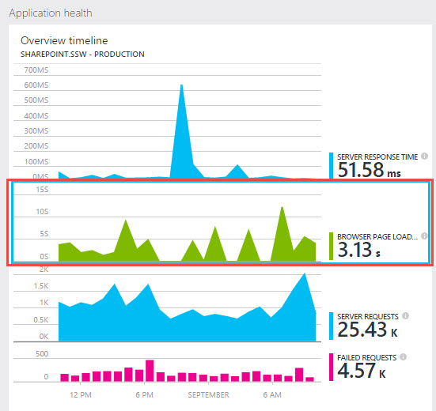
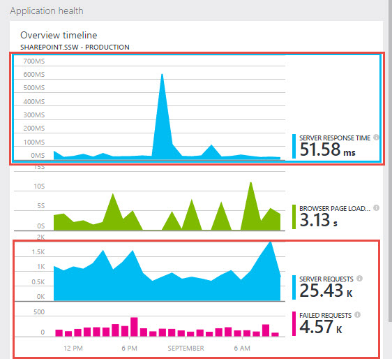

The easiest way to get started with Application Insights is to [follow the documentation on Microsoft Learn](https://learn.microsoft.com/en-us/azure/azure-monitor/app/app-insights-overview?WT.mc_id=AZ-MVP-33518).

Lets take a look at the overview and our tips to help you get the most out of Application Insights.

<!--endintro-->

## An overview of the setup steps

Application Insights requires that you make 2 general modifications to your application:

1. On the client side, manually [add a Javascript tracker to your web page header](https://learn.microsoft.com/en-us/azure/azure-monitor/app/javascript-sdk?tabs=javascriptwebsdkloaderscript&WT.mc_id=AZ-MVP-33518) (i.e. by placing directly on each page or through a "master page" or "layout template"), this modification enables the "browser page loading time" monitor and can track client-side exceptions:

   

2. On the server side, [add the Application Insights DLL references and update web.config](https://learn.microsoft.com/en-us/azure/azure-monitor/app/asp-net?WT.mc_id=AZ-MVP-33518), these modifications enable the "server response time", "server request" and "failed requests" monitors. This step can either be done within Visual Studio when right-clicking on a project in Solution Explorer, but it can also be done with the server monitoring tool on ASP.NET applications you don't have control over (e.g. SharePoint).

  

### Tip #1: Add enhanced Exception tracking to your application

The default set up and configuration of Application Insights will send generic performance stats and Exceptions. If you will be using Application Insights to look deeper into these Exceptions then it is important to make sure the full stack trace is sent when Exceptions occur. This can be added to your application by adding code for all unhandled exceptions. Follow [Diagnose exceptions in web apps with Application Insights](https://learn.microsoft.com/en-us/azure/azure-monitor/app/asp-net-exceptions?WT.mc_id=AZ-MVP-33518) for more information.

### Tip #2: Add Web tests to monitor performance metrics over time

As soon as you have configured Application Insights, you should immediately add a web test to track the general performance trends over time. More information can be found at [Do you add Web Tests to Application Insights to monitor trends over time?](/do-you-add-web-tests-to-application-insights-to-montior-trends-over-time).

### Tip #3: What if you don't have the source code of your ASP.NET application

[Do you know how to set up Application Insights (in SharePoint)?](/application-insights-in-sharepoint) shows that you can use the Application Insights Status Monitor to monitor an application that’s already installed and running without updating the code or redeploying it.
