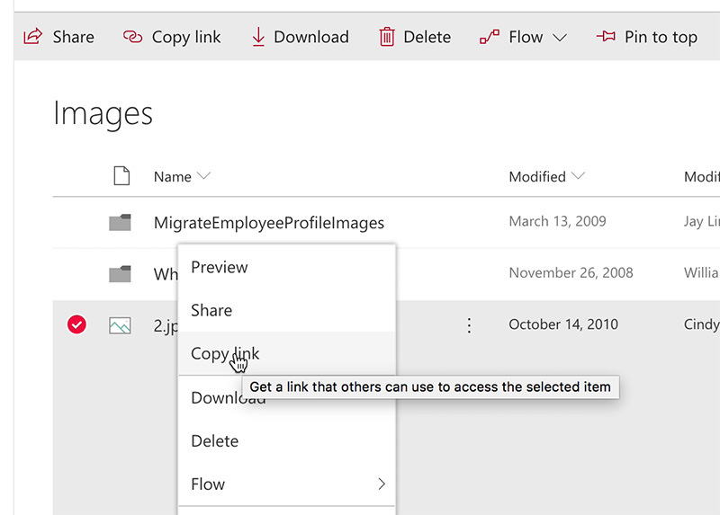
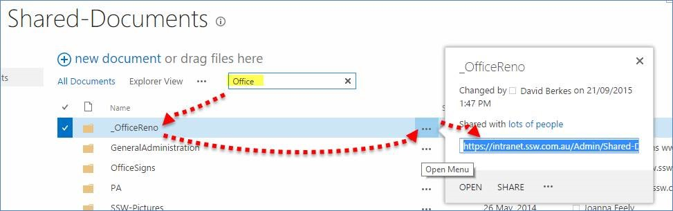

You often need to share links to a file or folder in SharePoint. 

<!--endintro-->

You can select the folder (or file) and click on "Copy link" at the top bar to get the link:

  

You can also right-click the folder/file to copy the link:

  

On previous versions, you can open the menu on ellipsis link and get it from there:

  

###  Related Rule

* [Do you know not to send attachments in emails?](/do-you-know-not-to-send-attachments-in-emails)
