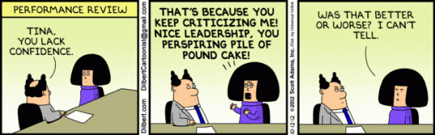
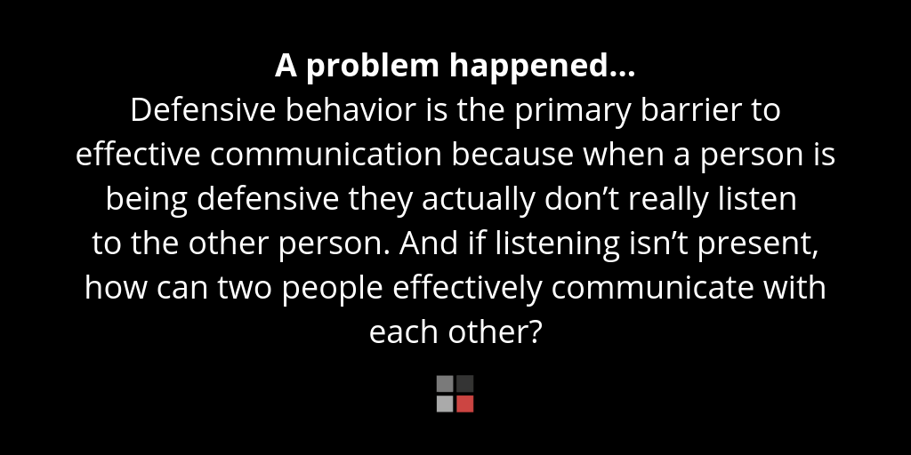

In any job, you will most likely at some point face some criticism. Someone may be telling you that you’ve done something wrong or just expressing displeasure because you didn’t do something they wanted.

<!--endintro-->

The best way to take this is to reply to the person and tell them the following 3 A's.

### The 3 A’s:  Acknowledge, Apologize, Act  

**Acknowledge -** The first part of good customer service is **acknowledging** that something happened. If you don't acknowledge the pain, then another person won't know if you agree or not.

**Apologize -** **Apologize** if you messed up… or even if you didn’t. Just be clear you are sorry for their situation. E.g. "I am sorry for the downtime you have been experiencing today"

**Action -** Lastly, explain how you will take **action** now, and in the future.

Even if you've been wrongly accused of something, you should still show you understand the other person's frustration and demonstrate initiative. Always have a view of the future and the big picture.

::: info
**Warning:** When wrongly accused of something, most people get stuck on defending themselves, where customers would prefer to hear you care, will take any ownership of the problem, and tell them your plan asap.
:::

Next is to see if you can avoid it happening in the first place – you could explain the new steps in the process you’ll add or simply say: "I'll be more diligent testing in the future".

::: greybox
More: **The 3 A’s of Business** (a great article from American Express)
https://www.americanexpress.com/en-us/business/trends-and-insights/articles/the-three-as-of-business/ 
:::

  

### Video 

`youtube: https://youtu.be/7wlUSq73Ejo`