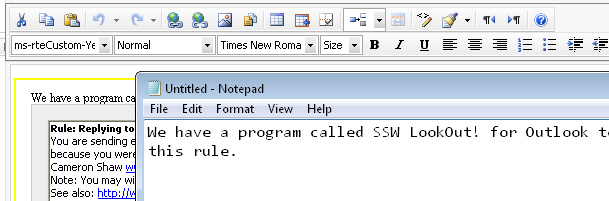
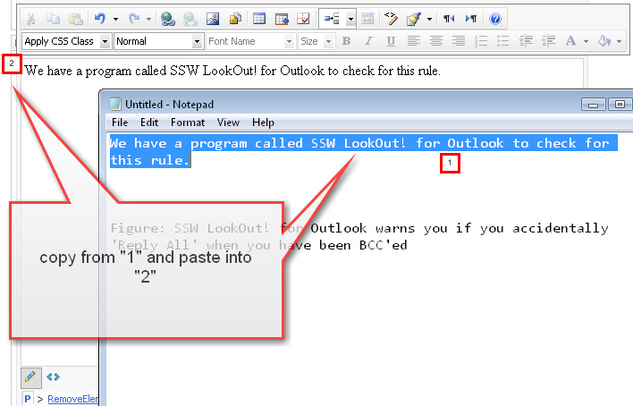
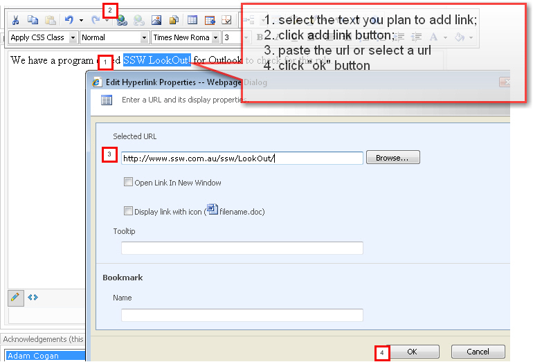
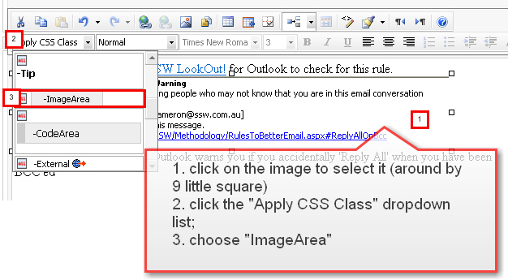
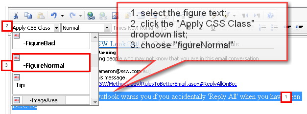

Do you know how to apply style to image, figure, etc?

Let's take the "AvoidReplyToAllWhenBcc" page as example.

<!--endintro-->

First, the reason to cause the style issue is the style doesn’t apply to right place. Below is the html code after you adjust the figure manually (sorry, still not right). Please look at the highlight part...

* The “ms-rteCustom-ImageArea” style doesn’t apply to &lt;img&gt; tag, but wrapped by &lt;span&gt; with “ms-rteCustom-ImageArea” style;

* There is no style apply to Figure:

``` html
<span class="ms-rteCustom-YellowBorderBox">We have a program called <a href="https://ssw.com.au/LookOut"> SSW LookOut! for Outlook</a> to check for this rule.
<br />
<span class="ms-rteCustom-ImageArea">
  
<br />
</span>
<br />
Figure: SSW LookOut! for Outlook warns you if you accidentally 'Reply All' when you have been BCC'ed
```

1. Not sure how user inputs the  content into this page. Anyway, here is the right way to add content via Telerik Editor. Please read below example of how I redo this part in Telerik Editor without changing the code manually



2. Delete the current content from Telerik for a new start;

3. Copy the first sentence from notepad and paste into Telerik Editor in the page; (please avoid copying straightly from web page and pasting them here, it will copy the all tags as well. it might affect the styles which can’t apply correctly)



4. Insert the image



5. Add an image


6. Press “enter” key to start a new row, then copy the figure from notepad to the Telerik editor area


7. Apply image style to the image by click on the image, then choose a style from “Apply CSS Class” dropdown list



8. Apply style to the figure


9.Apply the yellow box



10. Check in the changes, then you will have - "dada.."


