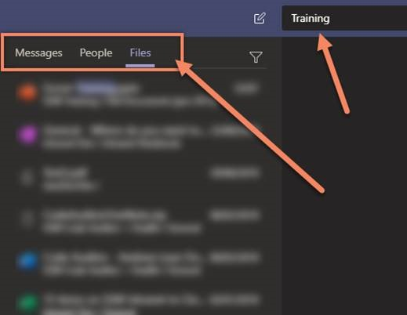
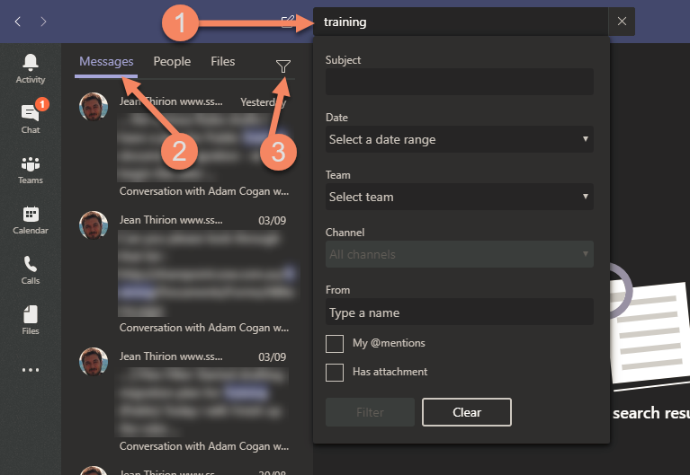

Teams search is designed to help you quickly find the files you are collaborating on.

From the main search box, you can search for:

* Teams
* Channels
* Files
* Messages
* People

<!--endintro-->

If you start typing in the search box, you will see all Teams and Channels that matches your query:

  

  

  
Figure: Channel associated to a Team result
**Warning:** If you hit enter, you will be redirected to the Messages, Files & People results. To see the Teams/Channels matching your query, simply click the search box again

Once you've hit "Enter", you can search through the different tabs to find messages, people or files that match your query across all teams

  

You can also use built in filters to refine your search, by clicking the "Filter" icon in Messages or Files tabs:

  

**Important:** Even though Teams search gives you quick access to all your messages and documents; the search is scoped to ONLY Teams, which means you cannot search for files hosted on SharePoint, OneDrive, other Office365 products (i.e. Delve/UserProfile) or external sources (i.e. Sugarlearning.com, Rules.SSW.com.au etc...). For this reason, it is advised to use the SharePoint Search instead.

### Related Rule

* [Do you know how to use SharePoint Search?](/do-you-know-how-to-use-sharepoint-search)
