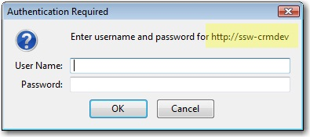
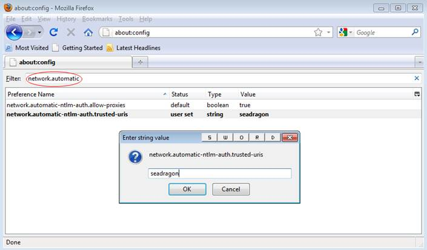
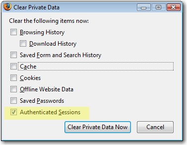

Internet Explorer has a great feature that you hardly notice. The Authentication credentials of the current user will be used by default.
<dl class="image"><dt> 
       
   </dt><dd>Figure: Internet Explorer has the Integrated Authentication feature built in</dd></dl>​​ 

In Firefox, if you sign-in to an internal server like SharePoint or CRM, you will get an authentication dialog. Even though you are already authenticated to the local domain.
<dl class="image"><dt></dt><dd>Figure: We want to avoid authenticating using Firefox (so it works like IE)</dd></dl>
 <excerpt class='endintro'></excerpt> 
<h3>The Solution</h3>​​​ 
<ol><li>Open Firefox</li><li>Go to "about:config"</li><li>Click "I'll be careful, I promise!"</li><li>Enter in the Filter box above: "network.automatic"</li><li>You see 2 records</li><li>Double-click the second one - It is the key called network.automatic-ntlm-auth.trusted-uris</li><li>Enter the servers delimited by ",", e.g. "aphrodite, mermaid"</li><li>Close browser and test</li></ol>​​​ 
<dl class="image"><dt>  </dt><dd>Figure: Showed how to find "network.automatic-ntlm-auth.trusted-uris" by using filter: "network.automatic"</dd></dl>
More info on this blog: <a href="http://www.cauldwell.net/patrick/blog/PermaLink%2cguid%2cc7f1e799-c4ae-4758-9de7-5c3e7a16f3da.aspx" target="_blank">Firefox and Sharepoint</a>.

   <b>Tip:</b> To test this without the Integrated Authentication enabled, you need to clear your session. You do this via: <b>Tools</b> | <b>Clear private data</b> | <b>Authenticated Sessions</b>.<b></b>  
<dl class="image"><dt></dt><dd>Figure: To test you will need to clear your "Authenticated Sessions" to completely logout from a site (SharePoint, CRM)</dd></dl>

