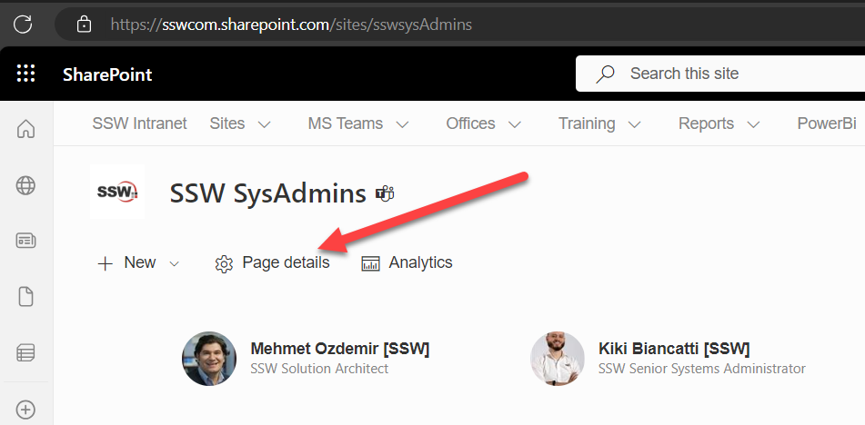
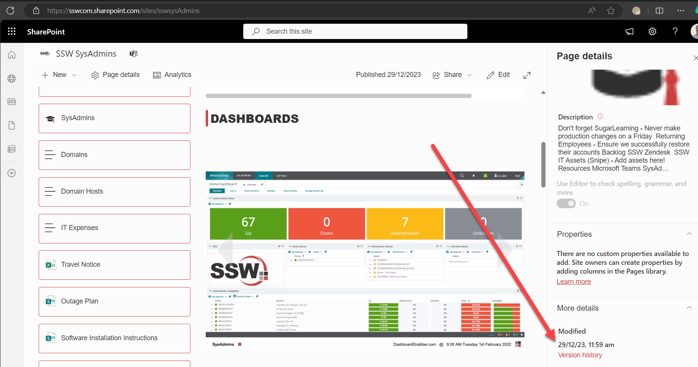
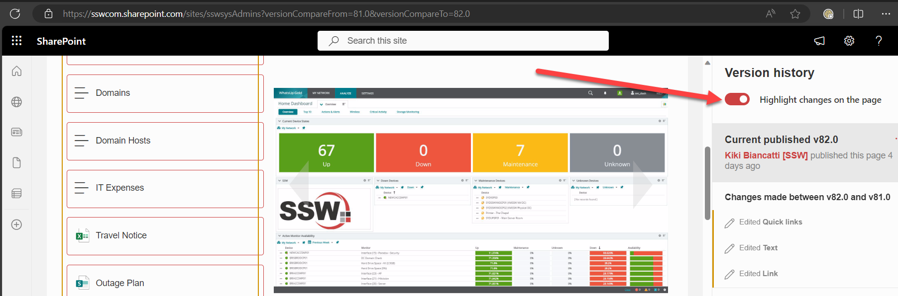
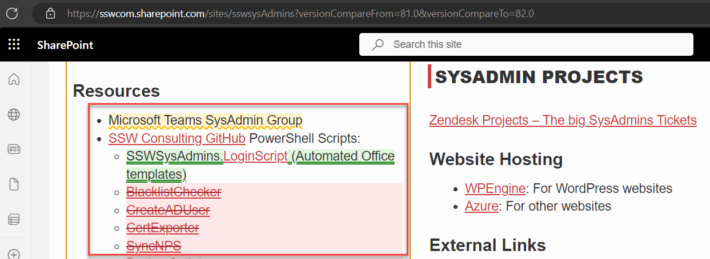

If you find a mistake on a SharePoint page, you should find who made the change before you fix it. That way you can inform the person of their mistake.

As long as you are using the Text Webpart (aka the Rich text editor), you can easily see the exact changes made in each version of the page. See the advantages of the Text Webpart in this rule: [Do you know why to use the Rich text editor over the Markdown editor?](https://www.ssw.com.au/rules/sharepoint-rich-text-markdown/)

<!--endintro-->

### Viewing changes on a SharePoint page

1. On the page you want to check, click on **Page details**

2. Click on **Version history**

3. Make sure **Highlight changes on the page** is on

4. View the changes

### Viewing changes to documents in SharePoint Online

1. For the document you want to check, click on the 3 dots (**Show actions**)
2. Click **Version history**

### Related rules

If you want to see how this is done in Azure DevOps, read [Do you know the benefits of using source control?](https://www.ssw.com.au/ssw/Standards/Rules/RulesToBetterSourceControlwithTFS.aspx#UsingSourceControl)