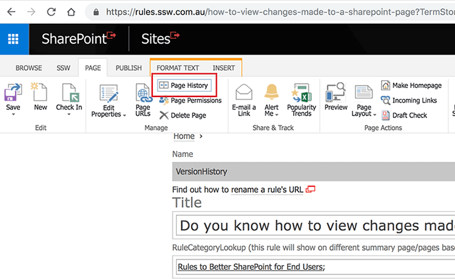
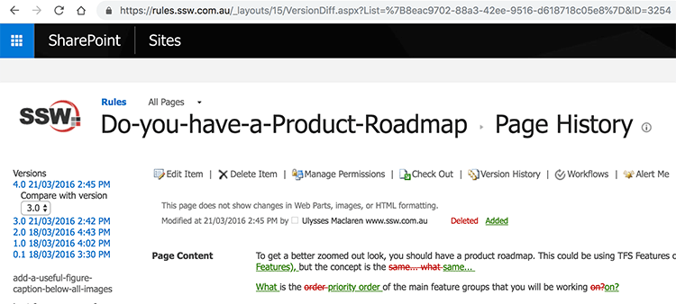

If you find a     mistake or typo you should look and see who is the culprit before fixing it. This way you can inform the person what was done.

Here is how you see the      **history** of the page:

  

  

Here is how you see the  **history** on Office 365 - SharePoint Online:

  

  

<!--endintro-->

Watch the video which explains how to view the version history for a page in SharePoint 2013 (Same as in SharePoint 2016). This allows you to see changes that were made to the page, as long as versioning is enabled in advance.

`youtube: https://www.youtube.com/embed/ump_dgj6cq4`

### Related rules

If you want to see how this is done in TFS, read [Do you know the benefits of using source control?](https://www.ssw.com.au/ssw/Standards/Rules/RulesToBetterSourceControlwithTFS.aspx#UsingSourceControl)
