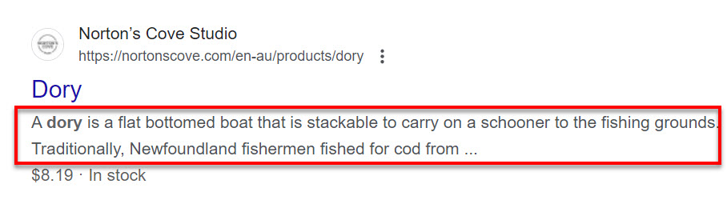
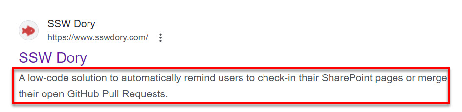

One of the easiest ways to get the ball rolling with your web pages and being noticed by search engines is to use [HTML &lt;meta&gt; tags](https://www.w3schools.com/tags/tag_meta.asp). Years ago, many webmasters took this as an opportunity to abuse the &lt;meta&gt; tags and the search engines found that the quality of search results was suffering. Today, search engines don't give the &lt;meta&gt; tags weight - Google announced in September of 2009 that neither **meta descriptions** nor **meta keywords** affects Google's ranking algorithms for web searches.

However, it's still beneficial to complete this quick and easy task.

<!--endintro-->


There are a few &lt;meta&gt; tags you should use, and these are the most common:

* **META DESCRIPTION** - Search engines will use the information in the &lt;meta&gt; description tag as well as the &lt;title&gt; to display a brief summary of your site that goes along with its link on search results. SEO experts recommends it to have between 50–160 characters. A well-crafted meta description can improve click-through rates from search results. Learn more on [Meta Description](https://moz.com/learn/seo/meta-description)
* **TITLE TAG** - The [title tag](https://www.semrush.com/blog/title-tag/) is crucial for SEO as it tells search engines what the page is about. It's also the headline that appears in search results. Keep it under 50-60 characters to ensure it displays properly in search results. Include primary keywords relevant to the page content, and ensure your title aligns with what users are likely searching for and addresses their needs or queries. Each page should have a unique title to avoid duplicate content issues and ensure each page can rank for different queries.
* **HEADER TAGS (H1, H2, H3 etc).** - [Header tags](https://www.semrush.com/blog/header-tag/) help structure content and signal to search engines the hierarchy of information. The H1 tag should contain the primary keyword and clearly describe the page content. Use H2, H3, etc., to organize subheadings and support the main topic.
* **ALT TEXT FOR IMAGES** - [Alt text](https://www.semrush.com/blog/alt-text/) provides a description of images, helping search engines understand the content of the images. Use relevant keywords but avoid keyword stuffing. Alt text also improves accessibility for visually impaired users.
* **CANONICAL TAG** - The [canonical tag](https://www.semrush.com/blog/canonical-url-guide/) helps prevent duplicate content issues by specifying the preferred version of a webpage. It tells search engines which version of a URL to index and rank.
* **ROBOTS META TAG** - [This tag](https://www.semrush.com/blog/beginners-guide-robots-txt/) controls how search engines index and follow links on your page. Common values are "index, follow" (default), "noindex" (do not index the page), and "nofollow" (do not follow links on the page).
* **META KEYWORDS** (less important) - This tag was used to help search engines classify your content. However, major search engines like Google no longer use meta keywords for ranking purposes. It's generally unnecessary to include them. Learn more on [Meta Keywords: Should You Use Them?](https://www.semrush.com/blog/meta-keywords/)

[View more on &lt;meta&gt; tags](https://www.w3schools.com/tags/tag_meta.asp)

To ensure your meta tags are present and well formatted, we have a useful program called [SSW Code Auditor](https://codeauditor.com/).





#### Avoiding Duplicate Content

**The duplicate content myth** There is a widely held misconception that Google penalizes authors for having duplicate meta tags, particularly meta description and meta title tags. However, Google primarily targets pages that are exact duplicates of other pages when penalizing for duplicate content. Read more about this in Google's [original blog post](https://tina.io/docs/reference/fields/#definition).

**Why you should care about duplicate content** While having duplicate meta title or meta description tags may not impact your search engine performance directly it can still result in a [poor user experience](https://www.semrush.com/blog/duplicate-meta-descriptions/). For example, if two pages with the same title appear in a set of search results the user may be unsure which link to click. It may also impact your rankings in other search engines.

**Rectifying the issue** This issue is common for users publishing content with a CMS. In this case we generally recommend meta descriptions and title fields a required field. For example, Tina CMS allows you to add [required fields](https://tina.io/docs/reference/fields/#definition). You could also get creative and pass the drafted content of your page into a custom GPT with instructions to create a summary of the content suitable for a meta title or meta description. For more information about creating custom GPTs read the rule [Do You Create Custom GPTs](https://www.ssw.com.au/rules/create-gpts/).

#### Quality Meta Descriptions

Even if you have a meta description tags filled out for a particular page Google may instead opt to use it's own summary of the content when displaying the link. This is called a **snippet**. If you'd prefer to use your own meta-description tags it's imperative to make sure your tag complies with [Google's quality standards for meta tags](https://developers.google.com/search/docs/appearance/snippet#use-quality-descriptions).

##### Snippets

A snippet is an auto generated summary of the content for your web page. As the name would suggest, Google derives snippets by sampling the literary content of your page and trimmig it. The result is usually unsightly. If you'd prefer not to use them Google gives you the option to opt out using the **Googlebot** tag meta tag. For more information about the types of tags you can use to customize your search results see Google's \[meta tag, data-nosnippet, and X-Robots-Tag specifications](https://developers.google.com/search/docs/crawling-indexing/robots-meta-tag)

```html
<!--Google will not create a snippet for this page-->

<meta name="googlebot" content="nosnippet">
```
