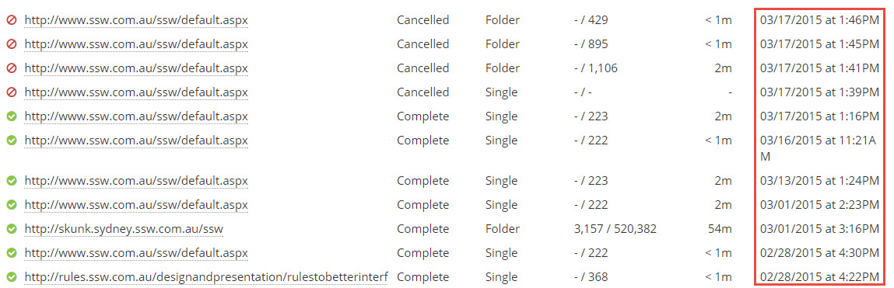
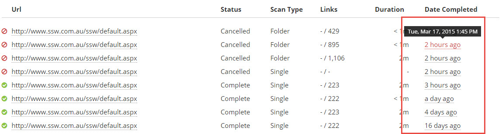

Ever looked at a date on a website and had to stop and think, _"Wait, when was that?"_

Instead of displaying timestamps as a rigid date like "2025-03-10 14:30", a more human-friendly format—like "last Sunday" or "3 weeks ago" makes it much easier to grasp at a glance. This is especially useful for past dates, helping users quickly understand when something happened without doing mental math.

<!--endintro-->

::: bad

:::

::: good

:::

::: info
**Note:** As per the good example, it's a good idea to [include a tooltip with extra information about the date](/date-and-time-of-change-as-tooltip), in case the user needs them.
:::
