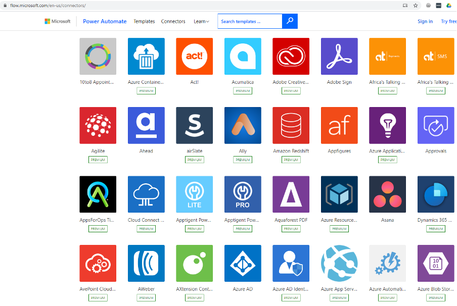

One huge advantage that Canvas Power Apps has over a Model-Driven App is the number of connectors supported. As of October 2020, there are 300+ supported connectors. That means the hard work and the integration between your Power Apps and 300 plus external data sources is taken care of for you. On top of this, you can create custom connectors too. [See all the Power Automate connectors currently available](https://make.powerautomate.com/connectors).

<!--endintro-->

