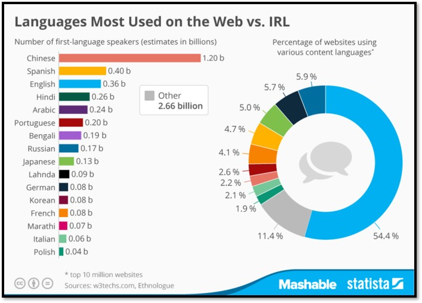
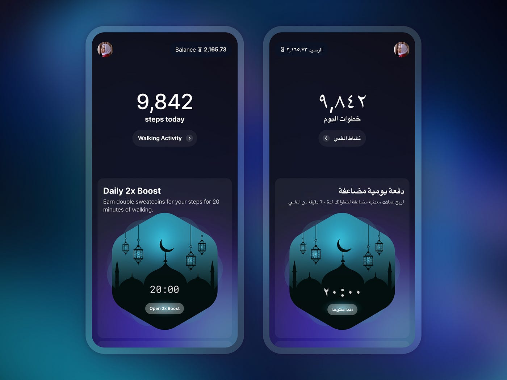

Amazon's Swedish website accidentally replaced "rooster" with the Swedish word for male genitals. An Italian company named their international site powergenitalia.com instead of powergen-italia.com back in 2003. These weren't just translation mistakes, they were internationalization disasters that exposed fundamental marketing failures.

The companies that succeed globally ([Spotify](https://www.nimdzi.com/lessons-in-localization-spotify-expanded), Netflix, Uber) don’t just translate. They design from day one for cultural, linguistic, and technical differences.

<!--endintro-->

::: china
Chinese has the largest number of native speakers and represents a huge market opportunity. Check out our rules - [Do you know why you should Chinafy your app?](https://www.ssw.com.au/rules/do-you-know-why-you-should-chinafy-your-app/)
:::

## The expensive confusion: i18n vs l10n

### **Internationalization** (i18n) - The architecture

The word “internationalization” is long, so we shorten it to **i18n** because there are 18 letters between the “i” and “n.”  
According to the W3C, internationalization means **designing your product so it can easily adapt to different languages and cultures** before you start translating.  

Think of it like **building a website with a flexible backend**.  
You set up your framework so it supports multiple languages: text is not hardcoded, date and currency formats can be customized, and layouts can adjust for right-to-left text.  
You are not adding translations yet. You are just making sure the system can handle them later without breaking.  

### **Localization** (l10n) - The Implementation

If i18n is the framework, **l10n** is when you actually **fill in the details for each locale**.  
This is where you add translations, apply regional settings, and adjust visuals such as date formats, currencies, or culturally specific images.  

This step is where you confirm that your internationalized website truly works for users in Japan, Germany, or Brazil, and fix anything that does not fit.

## Common i18n issues and tips

Here are the most frequent pitfalls developers encounter when scaling globally:

1. **UX - No language options**: Users are stuck with 1 language  
  ✅ Provide a language selector (see rule [Do you always give the user an option to change the locale?](https://www.ssw.com.au/rules/do-you-always-give-the-user-an-option-to-change-the-locale/))
2. **Character encoding**: All countries using non-latin scripts (japanese, chinese, korean, etc.)  
  “Björk” becomes “Bj?rk” in sweden  
  or 田中さん turns into “???” in japanese  
  ❌ No assumptions about ASCII-only inputs  
  ✅ UTF-8 end-to-end (DB, API, frontend) 
3. **Dates & numbers**: “03/04/2025” means March 4 in the US, April 3 in Europe, or something else in Japan. Decimal points and commas vary by region and can cost money
  ❌ Don’t parse strings manually  
  ✅ Use `Intl.DateTimeFormat`, `Intl.NumberFormat` or libraries like [date-fns](https://date-fns.org/)  
4. **UX - Text expansion & contraction**: German words can be 30–40% longer, while Chinese can compress paragraphs into a handful of characters  
  ❌ Don’t hardcode pixel widths for buttons or labels  
  ✅ Use flex layouts, `min-width`, `word-break`  
5. **Names & forms**: Some cultures have one name, some have none that fit “first/last”(i.e. Indonesia, Tibet)  
  ❌ Never force “First Name / Last Name” globally  
  ✅ Use a single “Full Name” field, or make name parts optional  
6. **Infrastructure blind spots**: Networks too slow, CDNs not present where your customers are  
  ❌ Don’t ship a 5MB JS bundle to mobile-first markets  
  ✅ Use a CDN close to your users  
  ✅ In China, use local CDNs to avoid latency from the Great Firewall  
  ✅ Subset fonts or use system fonts 
7. **RTL layouts**: For instance, Arabic language flip entire UI structures, not just text direction (see image below)  
   Note: RTL stands for "Right-To-Left"  
  💡 Arabic accounts for 5% of internet users (300M+). Supporting RTL means mirroring the entire UI, not just text.  
  ✅ Test with `direction: rtl;`  
  ✅ Use a combination of  logical CSS properties (`direction: rtl;`) instead of `left`/`right`  
8. **Cultural symbols**: White means purity in the West, but death in China. Even colors can alienate users  
  ❌ Don’t assume Western metaphors apply everywhere  
  ✅ Test color/icon choices with local users (white = death in China)  

::: greybox  
Check out our rules [Use a CDN for Internationalization](/use-a-cdn/)
:::

## Traditional i18n approach

### Option A - Rely on Google Translate (0 effort)

Users can rely on Google Translate in their browser if implementation time is lacking.

#### ✅ Pros

* Immediate availability with zero development effort  
* No implementation or maintenance costs

#### ❌ Cons

* Poor user experience and unprofessional appearance  
* Inaccurate translations and broken UI elements  
* Potential loss of international users  

### Option B - Implement i18n libraries

Use standard i18n tools (see below) with an internal translation workflow.  

#### ✅ Pros

* High-quality, controlled translations  
* Professional multilingual user experience  
* Native language support and better SEO  
* Full control of data

#### ❌ Cons

* Significant development time and delays  
* High translation costs: 0.08–0.15 $AUD per word for professional translators (potentially €5,000–15,000+ per language for a typical app)  
* Ongoing costs for maintaining and updating translations with each new feature  
* Complex maintenance of language files  
* Slow update process for new content  

### Useful non-AI tools

* **[i18next](https://www.i18next.com/)** (JS/React): Manages translations and language switching  
* **[FormatJS](https://formatjs.io/)**: Dates, numbers, and message formatting  
* **[Globalize.js](https://github.com/globalizejs/globalize)**: Number/date formatting, message translation, plurals  
* **[Angular i18n](https://angular.dev/guide/i18n) / [ngx-translate](https://github.com/ngx-translate/core)**: First-class localization for Angular apps, see Rule [Do you add multilingual support (Angular)](https://www.ssw.com.au/rules/add-multilingual-support-on-angular/)

## AI-tools

### Exploring AI agents in i18n

Internationalizing an app after you’ve hardcoded strings everywhere is one of the toughest real-world i18n challenges. In this video, Ben Morss shows how **AI agents** can scan your codebase, create i18n keys, and automate translations.

`youtube: https://youtu.be/YpVnqI5ljgY?si=jPR7PuV9o6gmneH5&t=491`  
**Video: Apidays Munich 2025 - AI translation + AI agents = i18n made easy By Ben Morss - watch from 8:10 to 16:40 (8 min)**

In this part, Ben Morss shows how an AI agent can internationalize a monolingual site by:

* Scanning the codebase to detect hardcoded strings
* Proposing i18n keys and replacing literals with t() function calls.
* Generating JSON resource files and populating them with translations.
* Opening a pull request so humans can review and approve.

🔗 More detail in the related article here: [AI translation + AI agents = i18n made easy (or is it?) - APIscene](https://www.apiscene.io/ai-and-apis/i-agents-i18n-translation-apis/)

### Choosing the right i18n strategy by project size

Your i18n strategy should match your project’s size, requirements, and resources. Use the guide below to find the best fit.

#### 1. Small project - Essentials (POC)  

**Use case:** Quick prototypes, one-person projects, proof-of-concepts.  
**Approach:** Minimal setup. Extract strings, machine translate, quick human check.  
**Stack:** use traditional non-AI i18n approaches.  

✅ Cheap, fast, avoids future i18n debt  
❌ Manual releases, limited scalability, brand/tone risks  

#### 2. Medium project - Step further with TMS  

**Use case:** Multi-language app with a small team, growing product with consistent branding needs.  
**Approach:** Add a lightweight Translation Management System (TMS) like [Phrase](https://phrase.com/), [Lokalise](https://lokalise.com/), or [Crowdin](https://crowdin.com/). Enables glossary, screenshots, workflows.  
**Stack:** TMS + pseudolocalization tests.  

✅ Centralized management, easier scaling, better consistency  
❌ Licensing costs, more process overhead  

#### 3. Large project - AI in CI/CD

**Use case:** SaaS products with frequent releases, multiple languages, distributed dev teams.  
**Approach:** Automate translations in the build pipeline. Machine translate → AI QA pass → human spot-check → auto-commit.  
**Stack:** CI/CD pipeline + TMS + LLM QA.  

✅ 80/20 automation, faster releases, consistent quality  
❌ Needs strong CI/CD setup, token costs, prompt governance  

#### 4. Enterprise project - Full-blown live LLM translation  

**Use case:** UGC-heavy platforms, fast-changing content, global e-commerce.  
**Approach:** Dynamic runtime translations (best for User-Generated Content, long-tail docs). Cache aggressively and use guardrails.  
**Stack:** LLM API + caching + glossary/do-not-translate rules.  

✅ Instant coverage, great for user content and fast-changing text  
❌ Latency, cost variability, SEO/quality risks, heavy monitoring needed  

## Summary table

| Project Size       | Use case                                                   | Stack Suggestion                 | ✅ Pros                                            | ❌ Cons                                  |
|--------------------|-----------------------------------------------------------|----------------------------------|------------------------------------------------|------------------------------------------|
| Small project      | Quick prototypes, one-person projects, proof-of-concepts  | i18next, Angular i18n/ngx-translate | Cheapest way to get started, avoids i18n debt | Manual, hard to scale, tone issues     |
| Medium project     | Multi-language app with a small team, growing product with consistent branding needs | TMS (Phrase/Lokalise) + pseudoloc | Centralized control, consistent translations | Adds license cost + extra process      |
| Large project      | SaaS products with frequent releases, multiple languages, distributed dev teams | TMS + CI/CD integration + AI QA  | Automation + speed, 80/20 human/AI workflow  | Needs mature CI/CD, token costs        |
| Enterprise project | UGC-heavy platforms, fast-changing content, global e-commerce | TMS for UI + Live LLM for content| Instant coverage for UGC + long-tail pages   | Latency, cost drift, SEO monitoring    |
