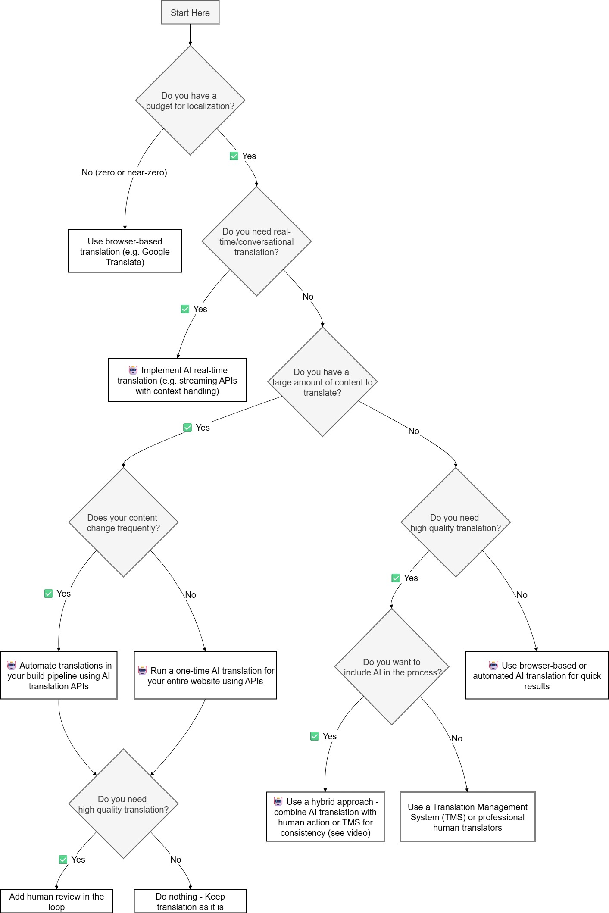

The companies that succeed globally ([Spotify](https://www.nimdzi.com/lessons-in-localization-spotify-expanded), [Netflix](https://www.weglot.com/blog/netflixs-localization-strategy), [Uber](https://www.nimdzi.com/lessons-in-localization-uber/)) don’t just translate. They design from day one for cultural, linguistic, and technical differences.

You need to consider both technical and marketing factors. Amazon's Swedish website accidentally replaced "rooster" with the Swedish word for male genitals. An Italian company named their international site `powergenitalia.com` instead of `powergen-italia.com` back in 2003. These were more than bad translations. They revealed big marketing mistakes.

<!--endintro-->

::: china
China has the largest number of native speakers and represents a huge market opportunity. [Want to bring your applications into the Chinese market?](https://www.ssw.com.au/consulting/chinafy-app)
:::

## The expensive confusion: i18n vs l10n

### Internationalization (**i18n**) - The architecture

The word “internationalization” is long, so we shorten it to **i18n** because there are 18 letters between the “i” and “n.”  According to the W3C, internationalization means **designing your product so it can easily adapt to different languages and cultures** before you start translating.  

Think of it like **building a website with a flexible backend**. You set up your framework so it supports multiple languages: text is not hardcoded, date and currency formats can be customized, and layouts can adjust for right-to-left text.  

You are not adding translations yet. You are just making sure the system can handle them later without breaking.  

### Localization (**l10n**) - The implementation

If i18n is the framework, **l10n** is when you actually **fill in the details for each locale**. This is where you add translations, apply regional settings, and adjust visuals such as date formats, currencies, or culturally specific images.  

This step is where you confirm that your internationalized website truly works for users in Japan, Germany, or Brazil, and fix anything that does not fit.

## Common i18n pitfalls

Here are the most frequent pitfalls developers encounter when scaling globally:

#### UX - No language options

* ❌ **Issue:** Users are stuck with one language.  
* ✅ **Tip:** Provide a language selector (see rule [Do you always give the user an option to change the locale?](/do-you-always-give-the-user-an-option-to-change-the-locale/)).  

#### UI - Character encoding

* ❌ **Issue:** Countries using non-latin scripts might not render correctly - e.g. “Björk” becomes “Bj?rk” or " 田中さん " turns into “???”.  
* ✅ **Tip:** Use UTF-8 end-to-end (database, API, frontend).  
* **Note:** Modern build tools (Create React App, Angular CLI or Vite for Vue.js) include UTF-8 charset in their HTML templates by default. You should still verify whether it's included in your `index.html` file and configured correctly on the server.  
  
#### UI - Dates & numbers formatting

* ❌ **Issue:** “03/04/2025” has different meanings - it means "March 4" in the US and "April 3" in Europe.  
* ✅ **Tip:** Use `Intl.DateTimeFormat`, `Intl.NumberFormat` or libraries like [date-fns](https://date-fns.org/) instead of parsing strings manually. If you do everything correctly, your browser will handle the date format for you.

#### UI - Text expansion and contraction

* ❌ **Issue:** German words can be 30–40% longer, while Chinese can compress paragraphs into a handful of characters.  
* ✅ **Tip:** Use responsive layouts and **visually check text in different languages**.  

#### UI - Names & forms

* ❌ **Issue:** Some cultures have one name, some have none that fit “first/last” (i.e. Indonesia, Tibet).  
* ✅ **Tip:** Use a single "full name" field, make last name optional.  

#### UI - Cultural symbols

* ❌ **Issue:** Colors can alienate users - white means purity in the West, but death in China.  
* ✅ **Tip:** Test color/icon choices with local users.  

#### Performance - Infrastructure blind spots

* ❌ **Issue:** Slow performance or broken assets in regions with limited infrastructure.  
* ✅ **Tip:** Optimize delivery globally — [use nearby CDNs](/use-a-cdn/) or smaller bundles.  

   ::: china
   [Do you know why you should Chinafy your app?](/do-you-know-why-you-should-chinafy-your-app/)
   :::

#### RTL layouts

* ❌ **Issue:** Arabic and Hebrew languages are written Right-To-Left (RTL).  
* ✅ **Tip:** Test with `direction: rtl;` Use a combination of logical CSS properties (`direction: rtl;`) instead of `left`/`right`.  
* Note: Be mindful to also change the images layout, not just the text.  

   ::: info
   **Tip:** Arabic accounts for 5% of internet users (~250M).
   :::

   ::: img-medium
   
   :::

## Choosing the right solution

When planning your i18n strategy, start by matching the solution to your project’s **complexity, content volume, and update frequency**.  

For many teams, **traditional i18n and l10n tools** are still the best choice. They’re stable, well-documented, and integrate easily into existing workflows.

However, as software becomes more dynamic and content-heavy, **AI-powered localization** is emerging as a powerful complement to these traditional methods. AI can analyze your codebase, identify hardcoded strings, suggest i18n keys, and even automate translations across multiple languages. This reduces manual effort and accelerates the entire l10n process.  

🎥 Check out this video to see how AI can assist developers in creating a fully internationalized website:

`youtube: https://www.youtube.com/watch?v=YpVnqI5ljgY`  
**Video: Apidays Munich 2025 - AI translation + AI agents = i18n made easy By Ben Morss (18 min)**  
Tip: watch from 8:10 to 16:40 (8 min)

🔗 Blog: [AI translation + AI agents = i18n made easy (or is it?) - APIscene](https://www.apiscene.io/ai-and-apis/i-agents-i18n-translation-apis/)

Below is a **decision tree** that can be followed in order to figure out the optimal i18n solution for a given project:

