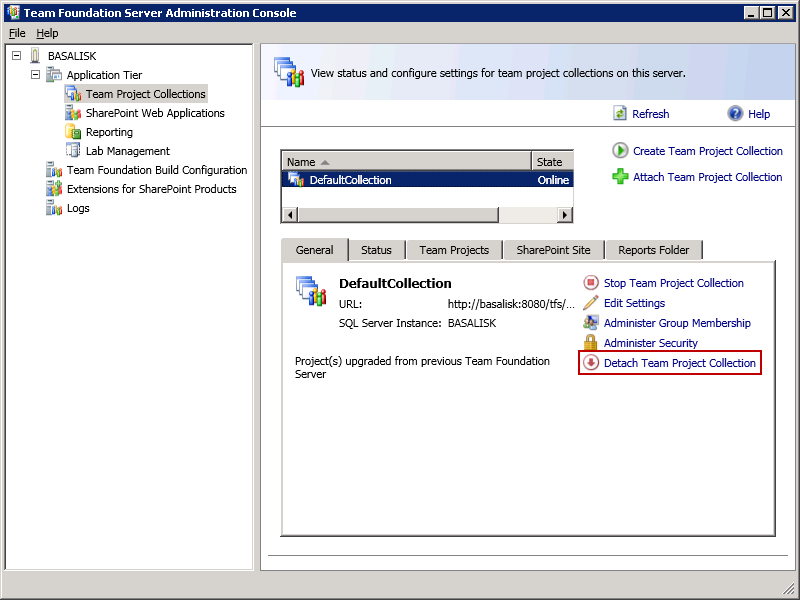
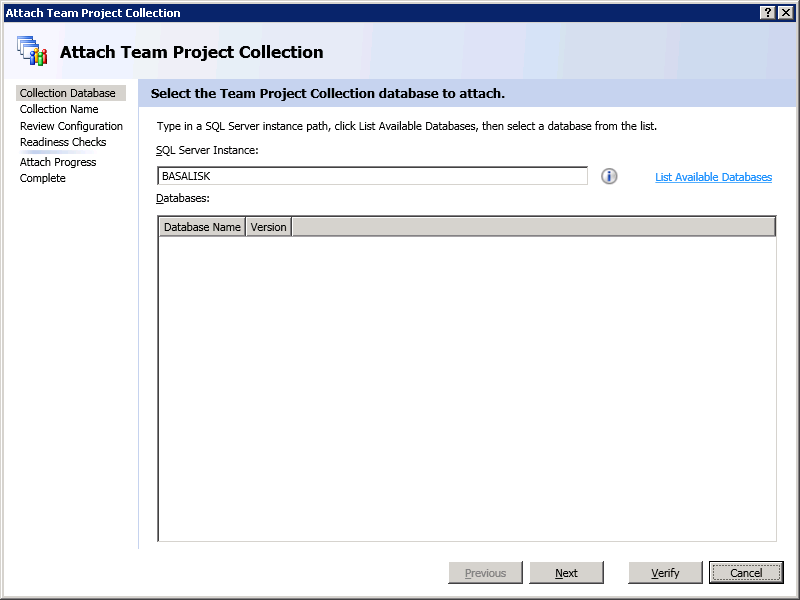

If you have already done some test migrations on the new server there is no need to start from scratch. Just follow these simple steps and you will be up and running in no time.

1. Open the Team Foundation Server Admin Console
2. Click Application Tier | Team Project Collections | Detach Team Project Collection

 
Figure: Remove the old Team Project Collection from the server.
3. Delete the Tfs\_\* databases except Tfs\_Configuration from SQL Server Management Studio
4. Delete the Tfs\_Analysis database from SQL Server Analysis Server.
5. Copy the TFS2010 backups to TFS2010 server (e.g. C:\TfsBackups)
6. Restore the databases to the TFS2010’s SQL 2008 Server
7. In the Team Foundation Server Admin Console
8. Click Application Tier | Team Project Collections |Attach Team Project Collection

9. Follow the wizard, [rule #8 from step 13](/Pages/UpgradeTFS2008Databases.aspx).

<!--endintro-->
