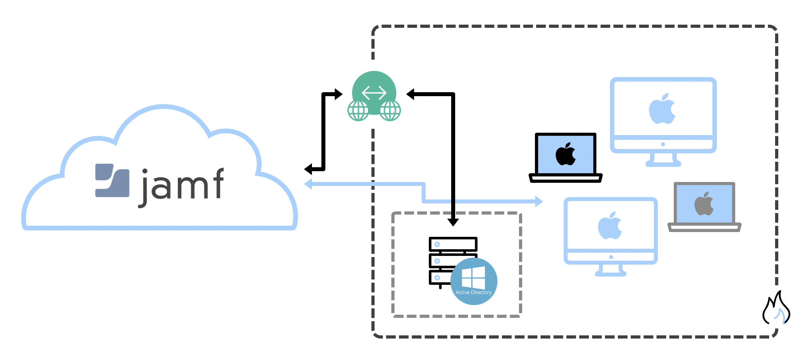

[Intune](https://www.ssw.com.au/consulting/intune) is a feature that focuses on mobile device management (MDM) and mobile application management (MAM). You control how your organization’s devices are used, including mobile phones, tablets, and laptops. You can also configure specific policies to control applications.

<!--endintro-->

Intune is a part of Microsoft's Enterprise Mobility + Security (EMS) suite. It integrates with Entra ID to control who has access and what they can access.

With Intune, you can:

- Choose to be 100% cloud with Intune, or be [co-managed](https://docs.microsoft.com/en-us/configmgr/comanage/overview) with Configuration Manager and Intune
- Set rules and configure settings on personal and organization-owned devices to access data and networks
- Deploy and authenticate apps on devices - on-premises and mobile
- Protect your company information by controlling the way users access and share information
- Be sure devices and apps are compliant with your security requirements

### Managing Devices

When Intune is connected to Entra ID its automatic enrollment lets users enroll their Windows devices in Intune. To enroll, users add their work account to their personally owned devices or join corporate-owned devices to Entra ID.

:::info

If you are using Conditional Access for MFA, you will need to add an exception for the **Microsoft Intune Enrollment** app for hybrid-joined devices to be able to enroll.

:::

- SysAdmins can monitor all the windows devices from [Microsoft Endpoint Manager admin center](https://endpoint.microsoft.com/?ref=AdminCenter#home)

- We can get reports on device compliance at any time.

::: bad

:::

::: good

:::

There are many other MDM solutions out there, but Intune is best if you're mostly managing Windows devices (and some iOS/Android as well). JAMF is a great option if you're only using iOS/MacOS devices.

