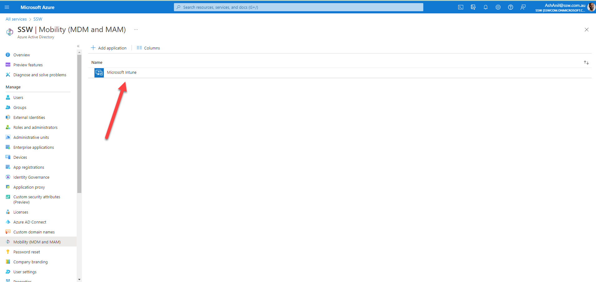
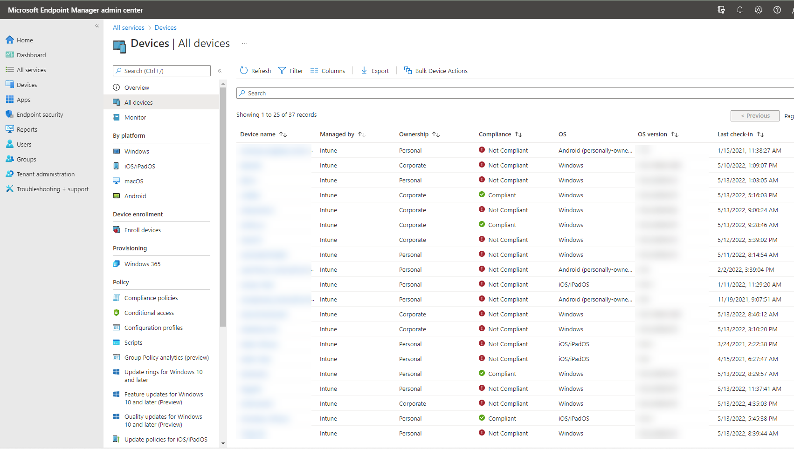
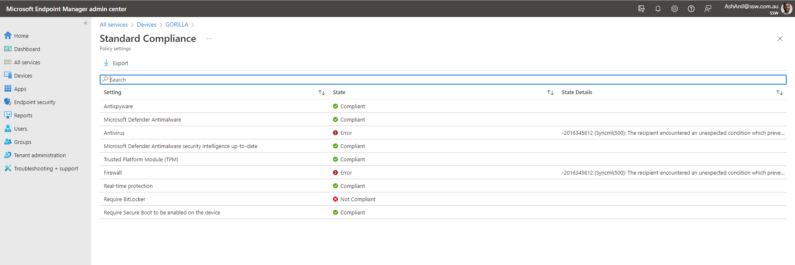
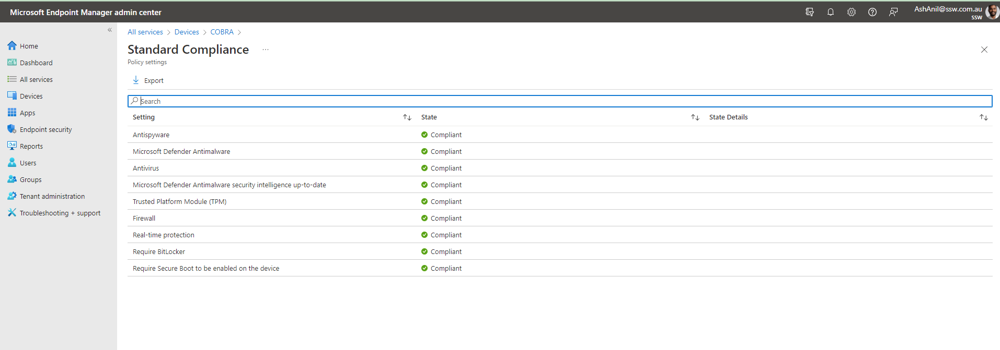

Do you control your  Organization's devices? Intune is a feature which focuses on mobile device management (MDM) and mobile application management (MAM). You control how your organization’s devices are used, including mobile phones, tablets, and laptops. You can also configure specific policies to control applications. 

Intune is a part of Microsoft's Enterprise Mobility + Security (EMS) suite. It integrates with Azure Active Directory to control who has access and what they can access.

<!--StartFragment-->

With Intune, you can:

* Choose to be 100% cloud with Intune, or be [co-managed](https://docs.microsoft.com/en-us/configmgr/comanage/overview) with Configuration Manager and Intune.
* Set rules and configure settings on personal and organization-owned devices to access data and networks.
* Deploy and authenticate apps on devices -- on-premises and mobile.
* Protect your company information by controlling the way users access and share information.
* Be sure devices and apps are compliant with your security requirements.

<!--EndFragment-->

## Managing Devices

When Intune is connected to Azure AD it's automatic enrollment lets users enroll their Windows devices in Intune. To enroll, users add their work account to their personally owned devices or join corporate-owned devices to Azure Active Directory. 

* SysAdmins can monitor all the windows devices from Microsoft Endpoint Manager admin center <https://endpoint.microsoft.com/?ref=AdminCenter#home>

* We can get reports on device compliance at any time. 

