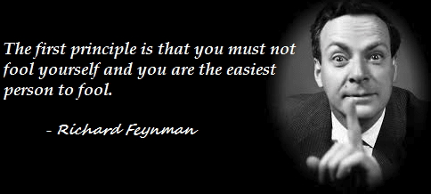
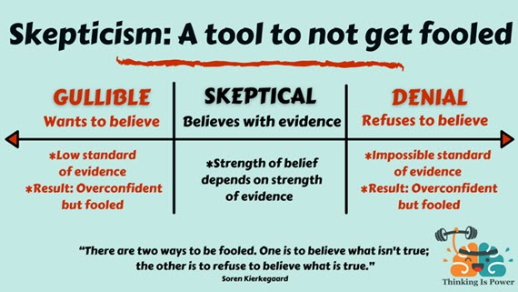

"Critical distance" refers to the difference between one perspective and another, the difference between two ways of thinking about the same thing. 

You know how easy it is for someone else to spot things - both good and bad - about your work that you haven’t noticed. You're "too close" to the work to be truly critical of it.

Developers naturally have a builder mindset focused on success, while testers are likely to have a more skeptical, critical-thinking mindset. 

The critical distance between the mindset of a developer and a tester is important for excellent testing. 

<!--endintro-->

### Diverse teams foster increased critical distance

Diversity in testing is an idea that has to be taken seriously, because it's essential to have different perspectives to foster critical distance between mindsets. 

::: greybox
The more we're all alike, the greater the chance that we'll be fooled by missing something important. 
:::

Diversity is a powerful heuristic for addressing that problem, not only diversity of genders and identities, but also of cultures, ethnicities, experiences, temperaments, skills, approaches, etc.

### Developer testing

While developers are building their code, their mental models of their work are already developed and so creating checks for specific factors and functions (e.g. in unit tests) is straightforward. 

This means that shallow testing of simple things can easily be performed by the developer. "Shallow" here refers to problems that are near the surface, close to the coal face of where the developer is working. 

Such shallow checking and testing is highly valuable; it's good to identify problems when they're less hard to see. But we must also remain alert to the fact that deeper, subtler, worse problems won’t all yield to this kind of shallow testing.

Developers are mostly envisioning success. They enact the essential, fundamentally optimistic task of solving problems for people, which requires believing that those problems can be solved, and building those solutions. Developers act as agents between the world of humans and the world of machines.

### Testing more deeply

While shallow testing is plausible at a close critical distance, deeper testing tends to require or create more distance from the builder’s mindset.

Testers are always responding to something that has been created by someone else. This is actually a good thing: the tester must develop an independent mental model of the product that was **not** developed in parallel with the building of it. In doing so, they create valuable critical distance.

Testers act as agents between the world of technological solutions and the world of skepticism and doubt. Testers must remain professionally and responsibly uncertain that there are no problems, even when everyone around us is sure there are no problems.

To find those deeper problems means challenging the product with complex testing: investigating for problems, not just confirming that everything seems OK. 

Critical distance is essential for deeper testing; to find hidden, subtle, rare, intermittent or emergent bugs; to probe the product to learn about problems unanticipated by the builders.

### Cultivate critical distance

Testing benefits from diverse perspectives which help cultivate critical distance, increasing the chances of identifying important problems in what we've built.

::: greybox
**Tip:** If a developer is acting as the tester for another developer's work (e.g. performing a ["Test Please"](/conduct-a-test-please-internally-and-then-with-the-client)), they still benefit from the critical distance of not having built what they're testing.
::: 

### Learn more

For a deeper treatment of this topic, watch James Bach's presentation, [Don't Think So Close to Me: Managing Critical and Social Distance in Testing](https://www.uttv.ee/naita?id=27696).