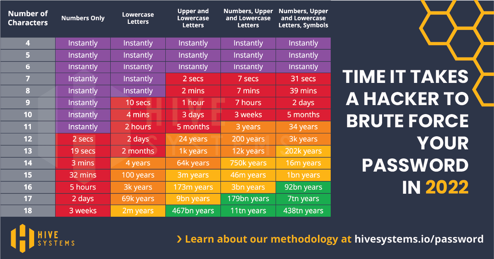

Passwords are a legacy technology that is not fit for the purpose that we use them today. We’re working our way towards a post-password world, in particular the FIDO alliance (<https://fidoalliance.org/>), and many biometric technologies, including fingerprint and face recognition that you may have in your phone. But for now, passwords are something we all need to live with.

<!--endintro-->

We’re used to seeing lists of password requirements, such as:

* Minimum length
* Complexity (e.g., must include upper- and lower-case letters, numbers, and special characters)
* Minimum age (e.g., you can’t change it more than once in 24 hours)
* Maximum age (e.g., you must change it every 30 days)

The most important of these is length.

Look at this graphic:

This table clearly shows that adding complexity (mixing upper and lower case, adding numbers, adding symbols) *does* increase the time it takes an attacker to brute forces your password, but not by much, and *only* in conjunction with a password of sufficient length.

In 2022, 10 characters should be the *absolute minimum* for a password. 12 characters is a better baseline, and 16 is what you should aim for.
