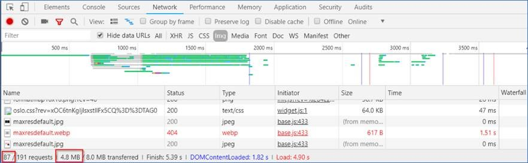
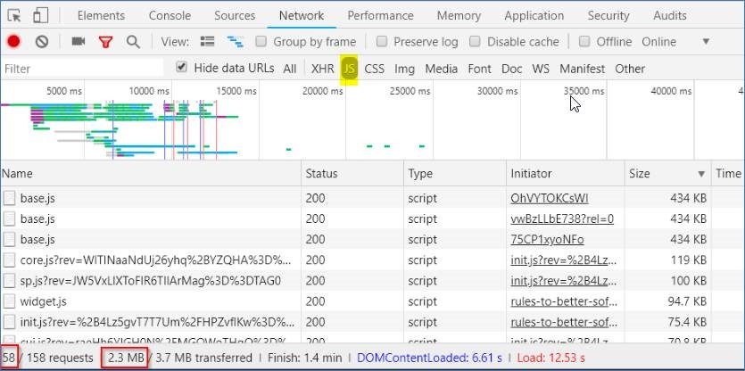
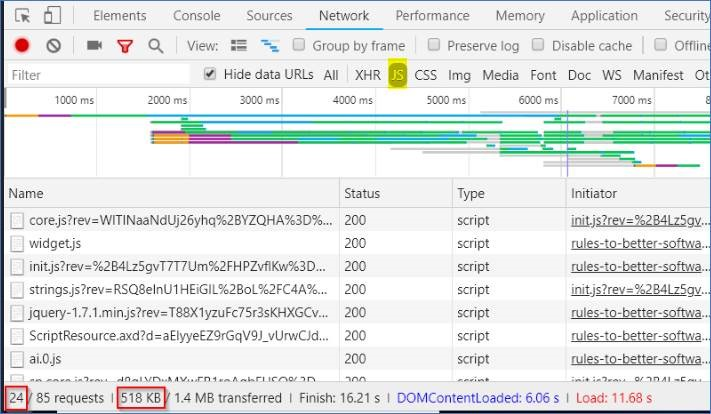

If you are dealing with Content Management System (CMS), you are likely to play with pages with large amount of images and embedded videos. To improve the performance of those pages, and save bandwidth for the readers, loading content asynchronously (also called “lazy loading”) is recommended.

It means the browsers will only load images and embedded videos in the visible area by default, then load the rest images and videos while users are scrolling down to them.

<!--endintro-->

### Real case scenario

On our SSW Rules website, one of the pages’ initial loading size of images reduced from 4.8MB to 500KB after being applied “lazy loading” of images:

::: bad  
  
:::

::: good  
  
:::

The page's initial loading size of JS scripts reduced from 2.3MB to 518KB after being applied “lazy loading” of embedded YouTube videos:

::: bad  
  
:::

::: good  
  
:::

### Implementing lazy loading for images

1. Check if the browser supports IntersectionObserver, if the browser supports IntersectionObserver, we will only load images and videos in the areas are visible to users by default. If the browser doesn’t support it, we will have to load all images and embedded videos on the page immediately after the page is loaded.

    ```js
    if (!('IntersectionObserver' in window)) {
        console.log("No Intersection");
    } else {
        console.log("Support intersection");
    }
    ```

**Note:** You can use a polyfill library to add **IntersectionObserver** support to older browsers.

2. If the browser supports IntersectionObserver, in your page html, change the “src” of “&lt;img&gt;” to “data-src”  
    From

    ```html
    
    ```

    to

    ```html
    
    ```

3. Use the below Javascript to change “data-src” back to “src” for the &lt;img&gt; html objects, which become visible, so that those images will be loaded

    ```js
    function onIntersection(entries) {
        // Loop through the entries
        entries.forEach(entry => {
            // Are we in viewport?
            if (entry.intersectionRatio > 0) {
                // Stop watching and load the image
                observer.unobserve(entry.target);
                //console.log(entry);
                //console.log(entry.target);          
                preloadImage(entry.target);
            }
       });
    }

    function preloadImage(target){
        console.log(target);
        if (target.getAttribute('data-src')) {
            target.setAttribute('src', target.getAttribute('data-src'));
        } 
    }

    // Get images of class lazy
    const images = document.querySelectorAll('.sswRuleSummaryUCDiv img');
    const config = {
        // If image gets within 50px go get it
        rootMargin: '50px 0px',
        threshold: 0.01
    };

    let observer = new IntersectionObserver(onIntersection, config);
 
    images.forEach(image => {
        observer.observe(image);
    });
    ```

4. More details can be found at [Updating jQuery-based Lazy Image Loading to IntersectionObserver](https://www.hanselman.com/blog/updating-jquerybased-lazy-image-loading-to-intersectionobserver) article.

### Implementing lazy loading for embedded YouTube videos

1. Use the same code as lazy loading images above, to check if IntersectionObserver is supported by browsers
2. In your page html code, convert “&lt;iframe&gt;” to “&lt;div&gt;” (width, height, src has been converted too):

    From

    ```html
    <iframe width="853" height="480" src="https://www.youtube.com/embed/OhVYTOKCsWI" frameborder="0"></iframe>
    ```

    To

    ```html
    <!-- (1) video wrapper in div instead of iframe -->
    <div data-iframewidth="853" data-iframeheight="480" data-iframecode="OhVYTOKCsWI" data-iframesrc="https://www.youtube.com/embed/OhVYTOKCsWI" frameborder="0">
        <!-- (2) the "play" button -->
        <div class="play-button"></div>      
    </div>
    ```

3. Use the below code to convert “&lt;div&gt;” to “&lt;iframe&gt;” to load the embedded videos when they are visible while scrolling down:

    ```js
    let youtube = document.querySelectorAll("div[data-iframesrc]");
    
    for (var i = 0; i < youtube.length; i++) {    
        let source = "https://img.youtube.com/vi/" + youtube[i].dataset.iframecode + "/sddefault.jpg";
        
        let image = new Image();
        image.src = source;
        image.addEventListener("load", function() {
            youtube[i].appendChild(image);
        }(i));
        
        youtube[i].addEventListener("click", function() {
            let iframe = document.createElement("iframe");
            iframe.setAttribute("frameborder", "0");
            iframe.setAttribute("allowfullscreen", "");
            iframe.setAttribute("width", this.dataset.iframewidth);
            iframe.setAttribute("height", this.dataset.iframeheight);
            iframe.setAttribute("src", this.dataset.iframesrc + "?rel=0&showinfo=0&autoplay=1");
            this.innerHTML = "";
            this.appendChild(iframe);
       });    
    };
    ```

More details can be found at [How to “Lazy Load” Embedded YouTube Videos](https://webdesign.tutsplus.com/how-to-lazy-load-embedded-youtube-videos--cms-26743t).
