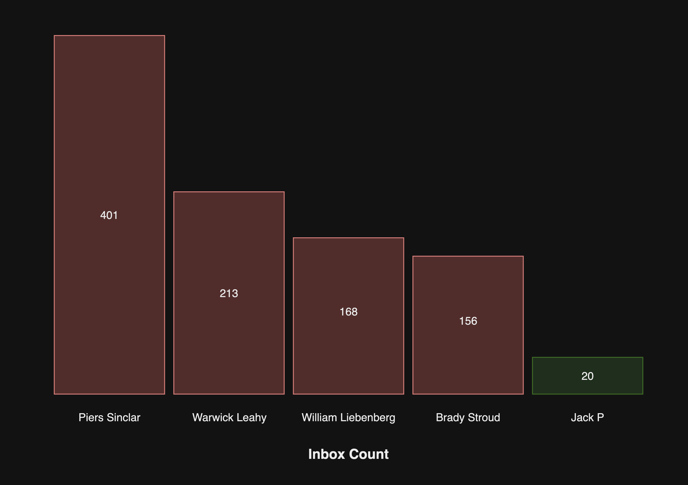

Some employees receive more emails than others and often do not dedicate enough time to managing their inbox
Its important that inboxes are managed and never get to an unmanageable state. 

We have some rules about [how to manage your inbox](/rules-to-better-inbox-management)

To mitigate this problem, organizations should have an Inbox Management team. This team should follow Scrum.

## Benefits of an Inbox Management Team
- **Collaboration**: Team members can share best practices and tools for effective inbox management.
- **Accountability**: Joining the Daily Scrums will ensure people stay focused on getting their inbox back to a manageable state

## How do you determine who joins the team?
People should only join the team if they have 100+ emails. Anything less than that is manageable.

To determine which people are in the team, create a report that tracks which employees have the most emails and make it someone's reponsibility to check this once a week.

<!-- TODO: Add screenshot of the report -->

**Figure: Report of employee inbox count**

Whenever someone changes team, their inbox should be checked to see if it's 100+.

## When do people leave the team?

When the Product Owner is happy with the person's inbox, they can leave the team and work on something else.