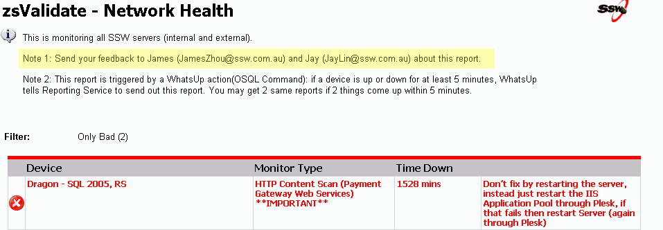

<!--endintro-->

A professional report should have the feedback information, then users can give suggestions directly to the designers.

::: good  

:::

See how AI is used in Power BI to provide feedback in Reports in [this rule](/rules-to-better-power-bi/)
