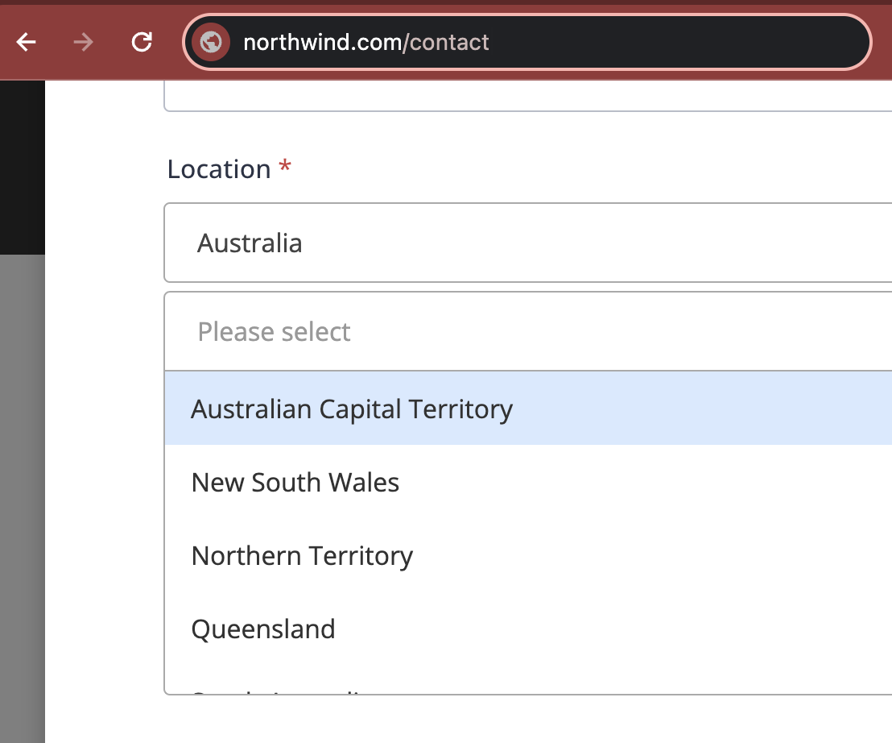

An email with just the word "Done" can often be enhanced with a screen capture or code snippet. Obviously this is also valid for tasks/requests.

In any email you send, **include relevant information**. Improved visibility and transparency will allow others to understand what was done or needs to be done straight away, such as:

* [URLs](/include-links-in-emails)
  * Links to where the change can be seen
  * Links to relevant PBIs in GitHub or Azure DevOps
  * Links to the related Pull Requests
* Screenshots
* [Done Videos](https://ssw.com.au/rules/send-done-videos/)
* Pieces of code/text
* Any more context or useful info

<!--endintro-->

::: info
For screenshots of a **browser** window, include the top-left area - so others can see the URL and guess what browser was being used (e.g. Chrome or Edge).
:::

### Reduced cost of fixing bugs

The cost of a bug increases with the length of time it takes for the client to request a change. Providing an email with all the details helps others see the changes immediately. If they need further adjustments, addressing them on the same day is much cheaper than handling the same request two months later, when the context may be forgotten.

Finally, in the very unlikely case that the code repository and backup goes corrupt, the emails are a backup!

::: email-template
| | |
| -------- | --- |
| To: | Dave |
| Subject: | RE: Northwind - Include one more field to the form |
::: email-content

### Hi Dave

Done on the contact page

:::
:::
::: bad
Figure: Bad example - "Done" email lacks details
:::

::: email-template
| | |
| -------- | --- |
| To: | Dave |
| Subject: | RE: Northwind - Include one more field to the form |
::: email-content

### Hi Dave

Done - added "State" field to the contact form: northwind&#46;com/contact

From:

{{ PREVIOUS CODE }}

To:

{{ NEW CODE }}

:::
:::
::: good
Figure: Good example - "Done" email has a link, a screenshot (showing the URL), and code changes
:::

### More useful details to include

* [Use balloons instead of a 'Wall of Text'](/screenshots-do-you-use-balloons-instead-of-a-wall-of-text)
* Include ["from X to Y"](/change-from-x-to-y) or a [.diff file](https://www.diffchecker.com) for greater code/text changes
