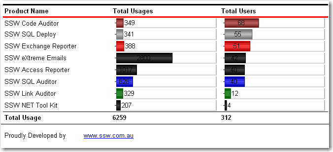
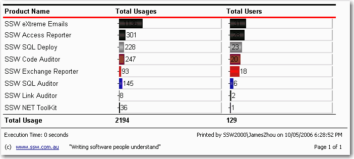
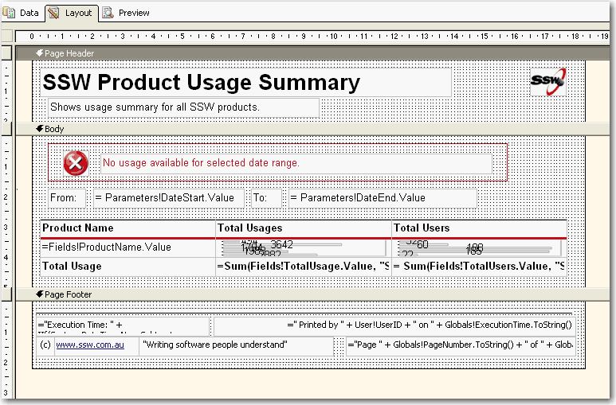

<!--endintro-->

You should always include a useful and informative footer at the bottom of your reports. Include:

1. Date and Time Printed and User who printed it - see warning below (e.g. Printed by SSW2000\JatinValabjee on 3/1/2006 3:16:30 PM)

2. Execution Time (e.g. Execution time: 1 minute, 10 seconds)

3. Page x of y (e.g. Page 3 of 10)

4. Link to company website + slogan  (e.g. <www.ssw.com.au> This opens in a New Window - Writing software people understand)

::: bad  
  
:::

::: good  

:::

Use these handy report expressions to show the above information.

| Footer Item                     | Expression                                                                                                                                                                                                                                                                                                                                                                                                                                                                                                                                                                         | Sample Output                                           |
|---------------------------------|------------------------------------------------------------------------------------------------------------------------------------------------------------------------------------------------------------------------------------------------------------------------------------------------------------------------------------------------------------------------------------------------------------------------------------------------------------------------------------------------------------------------------------------------------------------------------------|---------------------------------------------------------|
| Date and Time printed / User ID | ="Printed by " + User!UserID + " on " + Globals!ExecutionTime.ToString()                                                                                                                                                                                                                                                                                                                                                                                                                                                                                                           | Printed by SSW2000\JatinValabjee on 3/1/2006 3:16:30 PM |
| Execution Time                  | ="Execution Time: " + IIf(System.DateTime.Now.Subtract(Globals!ExecutionTime).TotalSeconds < 1, "0 seconds", ( IIf(System.DateTime.Now.Subtract(Globals!ExecutionTime).Hours > 0, System.DateTime.Now.Subtract(Globals!ExecutionTime).Hours & " hour(s), ", "") + IIf(System.DateTime.Now.Subtract(Globals!ExecutionTime).Minutes > 0, System.DateTime.Now.Subtract(Globals!ExecutionTime).Minutes & " minute(s), ", "") + IIf(System.DateTime.Now.Subtract(Globals!ExecutionTime).Seconds > 0, System.DateTime.Now.Subtract(Globals!ExecutionTime).Seconds & " second(s)", "")) ) | Execution time: 1 minute, 10 seconds                    |
| Page x of y                     | ="Page " + Globals!PageNumber.ToString() + " of " + Globals!TotalPages.ToString()                                                                                                                                                                                                                                                                                                                                                                                                                                                                                                  | Page 3 of 10                                            |

::: good  

:::

Tip: Copy and Paste this XML into the <PageFooter> for the recommended footer of all your *.rdl files.

```xml
 <PageFooter>

  Paste here

 </PageFooter>
```

Warning: Adding the User who printed it stops all data-driven subscriptions
When you try to add the User your data-driven subscriptions will fail with the following error:

'The '/GroupHealth' report has user profile dependencies and cannot be run unattended. (rsHasUserProfileDependencies)'.

A quick workaround is to add a user function to fallback the error to a nice message, like: "SYSTEM",

```vbnet
 Public Function UserName()
 Try
 Return Report.User!UserID
 Catch
 Return "System"
 End Try
 End Function   
```

Use above function to replace your reference to Report.User!UserID will allow the subscription to work correctly.
