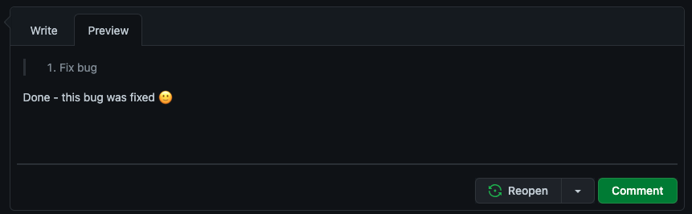
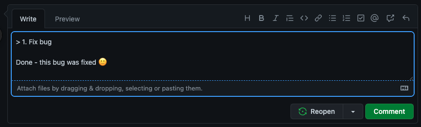

Indentation is a simple but powerful way to make your content easier to scan. When used wisely, it helps readers quickly see structure, hierarchy, and relationships between elements like questions and answers, examples, or nested lists. Overdoing it, however, can make layouts feel uneven or cramped—especially on mobile.

<!--endintro-->

## When indentation helps 👍

* **Nested Q&A sections** – When displaying questions and answers, a slight indent helps visually distinguish them and clarify their context
* **Lists or structured data** – Indenting bullet points, numbered lists, or code blocks improves scannability

## When indentation hurts 👎

* **Body text under headings** – Regular paragraphs should normally be left-aligned with the heading, not indented. Indenting them breaks alignment and creates uneven left edges, which hurts readability
* **Mobile layouts** – Indentation reduces usable width and can make text feel cramped on smaller screens
* **SEO and accessibility** – Overusing indentation via CSS (e.g., padding-left) doesn’t add semantic value and might even confuse screen readers or cause inconsistent spacing

---

### Q&A sections - Best practices for emails

Written communication can easily cause misunderstandings. Help the reader understand your message better by:

* Using “&gt;” and indentation when quoting the text from others, like the original email you are replying to.\
  **Note:** “&gt;” is not needed when quoting from a web page
* Make the question/task followed by the respective answer in a logical order
* [Add numbers to tasks](/number-tasks-questions) if the sender forgot.\
  Mention you changed the history. E.g. “(added numbers to tasks in the history, so we can clearly refer to them)”
* Your text should be always kept to the left

This way you won't forget any questions in the original email.

**Note:** You do not need to use ">" and indentation, when you are replying to the task that is very clear, because in this case extra text reduces clarity.

::: email-template

| | |
| -------- | --- |
| To: | Adam |
| Subject: | RE: Change on Northwind app |
::: email-content

### Hi Adam

Please change from X to Y\
The program flow logic worries me a bit\
Done. Sorry, this wasn't a final decision - I just put it there for testing purposes

:::
:::
::: bad
Figure: Bad example - There's too much information with no reasonable order
:::

::: email-template

| | |
| -------- | --- |
| To: | Adam |
| Subject: | RE: Change on Northwind app |
::: email-content

### Hi Adam

"Please change from X to Y"\
Done - northwind365.com\
"The program flow logic worries me a bit"\
Sorry, this wasn't a final decision - I just put it there for testing purposes

:::
:::
::: bad
Figure: Bad example - Order is OK, but it's using quotes to reference others' text + no indentation + missing numbers on questions/tasks
:::

::: email-template

| | |
| -------- | --- |
| To: | Adam |
| Subject: | RE: Change on Northwind app |
::: email-content

### Hi Adam

&nbsp;&nbsp;&nbsp; > 1. Please change from X to Y\
Done - northwind365.com\
&nbsp;&nbsp;&nbsp; > 2. The program flow logic worries me a bit\
Sorry, this wasn't a final decision - I just put it there for testing purposes

:::
:::
::: ok
Figure: OK example - Even with ">", indentation and numbers, without spacing the text becomes cramped and hard to read
:::

::: email-template

| | |
| -------- | --- |
| To: | Adam |
| Subject: | RE: Change on Northwind app |
::: email-content

### Hi Adam

&nbsp;&nbsp;&nbsp; > 1. Please change from X to Y

Done - northwind365.com

&nbsp;&nbsp;&nbsp; > 2. The program flow logic worries me a bit

Sorry, this wasn't a final decision - I just put it there for testing purposes

:::
:::
::: good
Figure: Good example - You can clearly see the context of each part of the reply
:::

::: info

**Tip #1:** When using Outlook, the raw “>” character may be automatically formatted to a “>” bullet point. This change is a problem because it may change to a normal bullet point after being sent. To prevent this issue, press Control+Z to turn it back into the raw “>” character.

**Tip #2:** For those using mobile devices the indentation function is not available, try instead using 3 spaces to indent manually

**Tip #3:** Note the extra line break after each reply... this helps group each question with it's answer

**Tip #4:** If you're quoting someone who already used >, you can use >>

**Tip #5:** Some people also [use a different text color in their reply](/when-you-reply-inline-do-you-use-a-different-color), but this is generally overkill

:::

### Indentation with Markdown

When using Markdown (usually on GitHub), use "&gt;" symbol (which means HTML `blockquote`) to achieve a similar result.

You can find more info about GitHub Markdown syntax at [Basic writing and formatting syntax](https://docs.github.com/en/github/writing-on-github/getting-started-with-writing-and-formatting-on-github/basic-writing-and-formatting-syntax).

**Video:** [Top 10+ Rules to Better Email Communication with Ulysses Maclaren](https://www.youtube.com/watch?v=LAqRokqq4jI)
