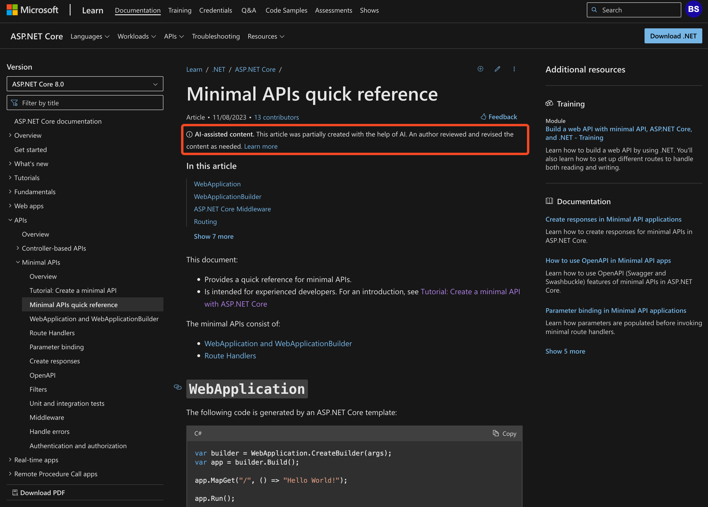

AI can be helpful, and in some situations, it is good to be transparent that it helped you. Other times, however, it is more important that the message feels like it came personally from you.

In the case that you want to be transparent, you should indicate when AI was used.

<!--endintro-->

When you want to be transparent (generally internal communication), there are benefits:

* **Adoption:** Spread and encourage usage of AI by showing how and when you use it, enabling others to think about when they can use it too
* **Transparency:** Others can identify AI-generated content, promoting openness and trust
* **Responsibility:** Encourages responsible use of AI-generated content

::: good

:::

For generated text, a good option is to use the 🤖 emoji.
You should use it at the end of your message/email/etc. There are 2 options:

1. Use 🤖 when you used ChatGPT but you edited the result  

   **Example:** *“Improve SEO with these tips: Create quality content, optimize for mobile, and use relevant keywords. 🤖”*

2. Use 🤖⭐ when the content is entirely generated by ChatGPT

   **Example:** *"As we watched the sunset from our office balcony, the conversation turned to the latest tech trends. The sky was painted in hues of pink and orange, but our minds were on the latest software updates and hardware releases. The birds chirped their goodnight songs as we debated the merits of different programming languages and platforms. It was a peaceful moment, a brief pause in the chaos of the tech world, and we couldn't help but feel grateful for the opportunity to work in such an exciting and constantly evolving industry.🤖⭐”*

:::greybox
**Notes:**

* Consider using this mostly internally, as clients and suppliers may not understand the meaning.

* In the second case, if you want to go the extra mile and demonstrate how you used it, you can even paste the prompt you used to generate your message.
:::

This is also important for generated images, Meta has developed invisible watermarks that can be used to indicate that an image was generated by AI.  
<https://aibusiness.com/responsible-ai/meta-develops-invisible-watermarks-to-track-ai-image-origins>

Google has also done something similar. Check out [SynthID](https://deepmind.google/discover/blog/identifying-ai-generated-images-with-synthid/)
