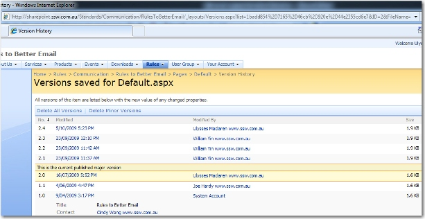

Add an extra column to the “Version History” page to show how big a change was made in each version (in number of lines modified or MB changed or something).

In this case the editor (Ulysses) clicked on edit just to see what it looked like from an Editor’s viewpoint, but there is no indication that there was no significant change.

The edits that were not significant should show their records as dimmed.

<!--endintro-->

**Figure: Version History**

**Note:** The URL should be nicer than this:

::: greybox
sharepoint&#46;ssw&#46;com&#46;au/Standards/Communication/RulesToBetterEmail/\_layouts/Versions&#46;aspx?list=1badd854%2D7165%2D46cb%2D920e%2D44e2355cd6e7&ID=2&FileName=%2FStandards%2FCommunication%2FRulesToBetterEmail%2FPages%2FDefault%2Easpx&Source=%2FStandards%2FCommunication%2FRulesToBetterEmail%2FPages%2Fdefault%2Easpx  
:::
