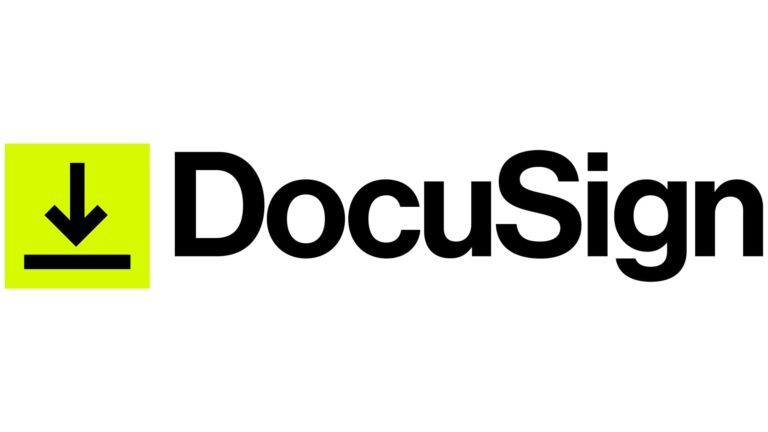

The age of printing, signing, scanning, and sending documents manually is far behind us. You've just been emailed an important contract and are expected to sign it within the hour. The issue? You're nowhere near a printer or scanner. This is where eSignature solutions come into play. They help expedite such processes with increased efficiency and security.

<!--endintro-->

## Compare DocuSign vs Adobe Sign

Both DocuSign and Adobe Sign are leading eSignature platforms, but they have distinct features and benefits:

### DocuSign: TODO: Tiago to create a table comparing the features based on the information below

1. **User Interface:** Known for its user-friendly interface and easy navigation.
2. **Templates:** Offers a wide variety of customizable templates.
3. **Integrations:** Has a broader range of integrations with business software.
4. **Cost:** $49 per standard user per month (or $348 annually when prepaid)
5. **Branding:** Included in the standard licence
6. **Analytics:** More powerful

### Adobe Sign: TODO: Tiago to create a table comparing the features based on the information below

* **Document Editing:** Allows users to make minor edits to the document before signing.
* **Cloud Storage:** Direct integration with Adobe's cloud storage solution.
* **Authentication:** Robust multi-factor authentication for added security.
* **Branding:** Not included in the standard licence
* **Cost:** $32.99 per standard user per month (or $224.27 annually when prepaid)

Source: <https://www.techrepublic.com/article/adobe-sign-vs-docusign/>

For more information on how to set up DocuSign, see 

<https://www.youtube.com/watch?v=U6BRPawNNfw&ab_channel=SolusignConsulting>

::: email-template  
|          |     |
| -------- | --- |
| To:      | XXX |
| Cc:      | YYY |
| Bcc:     | ZZZ |
| Subject: | {{Email subject}}  |  
::: email-content  
### Hi XXX,  
{{Email content}}    
:::  
:::  
::: good  
Figure: Good example - Nice email template  
:::

::: greybox 
*Northwind Pty Ltd wanted to integrate an eSignature solution into their workflow. After comparing features, they opted for DocuSign because of its broader integrations with their existing business software.*
:::
::: good 
Figure: Good Example – It’s essential to choose an eSignature solution that aligns with your business needs.
:::