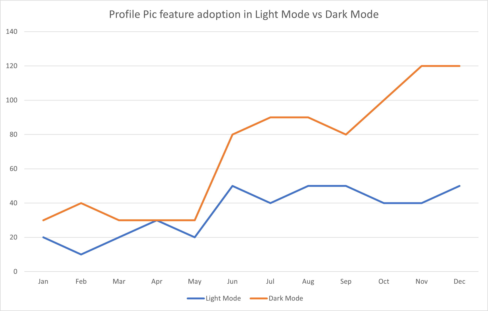
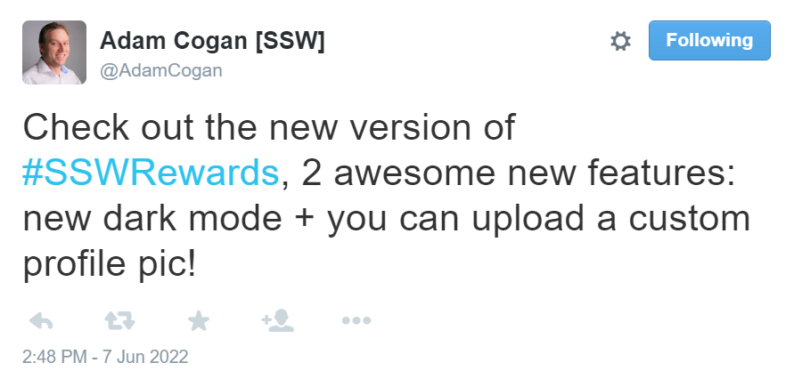

It’s easy to capture lots of telemetry from your software; everything from exceptions to usage statistics. But do you know what to do with it and how to interpret what this data is telling you? That’s the difference between information, intelligence, and wisdom.

<!--endintro-->
 
Your data is a potentially valuable asset and it should be working hard for you. Let's look at a hypothetical example involving adding a new feature to [SSW Rewards](https://www.ssw.com.au/ssw/Rewards/Default.aspx) that allows users to upload a custom profile pic. We want to know whether users are more likely to discover and adopt new features when using light mode vs dark mode. So we conduct some [A/B testing](/a-b-testing) to see which is working better.

### Level 1: Information  
 
Information tells you what happened. Lots of data is available and its easy to record it all now in a service like App Insights, but at this point it’s only information and you need to turn it into something useful for it to have value.

In this hypothetical example, we can see the following information about how many people used the new profile pic feature in light mode and how many used it in dark mode.

 
### Level 2: Intelligence
 
Intelligence tells you why something happened. Having lots of data is awesome, but you should be able to draw meaningful interpretations from that data, or better yet, as your data grows and you know how to recognise patterns in it, have your system draw these automatically and raise alerts about important events.

A simple analysis of the above A/B results shows that significantly more people use the profile picture feature in dark mode than in light mode. However, we can add some context:

With this additional context, we can look at the figure above and see that the feature got a boost in both light mode AND dark mode after this tweet. So it seems like the tweet did more to bost adoption of this feature than discoverability in dark mode did.
 
### Level 3: Wisdom
 
Wisdom tells you what you should do next. The information and intelligence that you are gathering should be usable to make informed decisions about how you should manage your system or business. A good business intelligence system should provide actionable recommendations rather than simply providing information and explanations.

::: info
**Note:** Your business intelligence system could be automated (awesome) but could also be a combination of automated reporting technology as well as human review processes (not as cool, but still better than not interpreting your data).
:::

With the added intelligence above, we can see that social media engagement seems to drive adoption of new features, so we should use this to promote these features when we deliver them. However we _can_ still see that engagement with dark mode seems to be higher, so we shouldn't discount this either.

However, the key gem of wisdom here is to isolate test variables so that we don't skew the results of our A/B testing, _or_ intentionally build [multivariate tests](https://www.youtube.com/watch?v=dYdTqoamI3Q) as well as the telemetry required to correlate and analyze the data from the different variants.

### Examples
 
| Information | Intelligence | Wisdom |
|--|--|--|
| Our app service goes offline every day at 3am | Increased demand between 2am, and 4am often pushes the system beyond peak capacity | Automate your infrastructure to scale out on a schedule to meet increased demand |
| We got 30% fewer clicks from our social media advertising in July than we did in June. | In July we diverted advertising budget away from social media platform A to social media platform B. Platform A generates more clicks than platform B | Should we focus all our advertising on platform A? No, because while platform B generates fewer clicks, it generates higher quality clicks (i.e. 70% higher conversions than platform A). | 
| What is this? It’s a hot dog. | Can I eat the hot dog? Yes. | Should I eat the hot dog? Probably not. |
