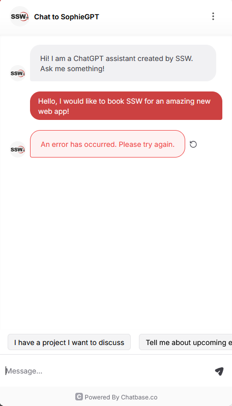
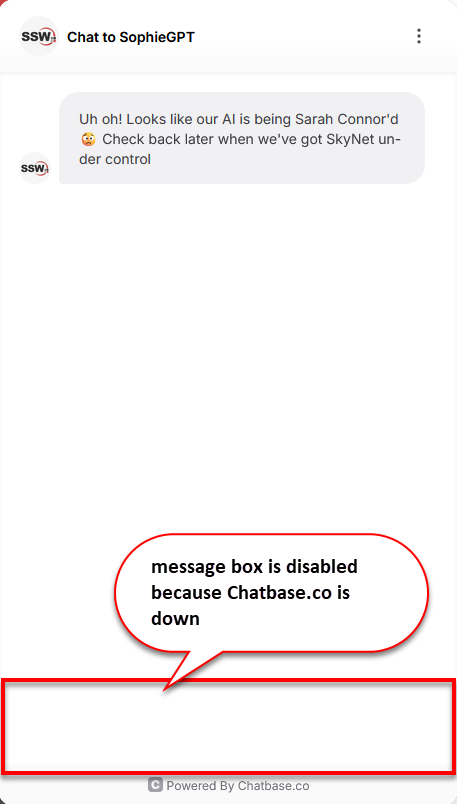

Most developers include [healthchecks for their own applications](/have-a-healthcheck-page-to-make-sure-your-website-is-healthy/), but modern solutions are often highly dependent on external cloud infrastructure. When critical services go down, your app could become unresponsive or fail entirely. Ensuring your infrastructure is healthy is just as important as your app.

<!--endintro-->

## Your app is only as healthy as its infrastructure

Enterprise applications typically leverage a large number of cloud services; databases, caches, message queues, and more recently LLMs and other cloud-only AI services. These pieces of infrastructure are crucial to the health of your own application, and as such should be given the same care and attention to monitoring as your own code. If any component of your infrastructure fails, your app may not function as expected, potentially leading to outages, performance issues, or degraded user experience. Monitoring the health of infrastructure services is not just a technical task; it ensures the continuity of business operations and user satisfaction.

`youtube: https://www.youtube.com/watch?v=4abSfjdzqms`
**Figure: How to add Healthchecks in ASP.NET Core (11 min)**

## Alerts and responses

Adding comprehensive healthchecks is great, but if no-one is told about it - what's the point? There are awesome tools available to notify Site Reliability Engineers (SREs) or SysAdmins when something is offline, so make sure your app is set up to use them! For instance, Azure's [Azure Monitor Alerts](https://learn.microsoft.com/en-us/azure/azure-monitor/alerts/alerts-overview) and AWS' [CloudWatch](https://docs.aws.amazon.com/AmazonCloudWatch/latest/monitoring/WhatIsCloudWatch.html) provide a suite of configurable options for who, what, when, and how alerts should be fired.

## Healthcheck UIs

Depending on your needs, you may want to bake in a healthcheck UI directly into your app. Packages like [AspNetCore.HealthChecks.UI](https://www.nuget.org/packages/AspNetCore.HealthChecks.UI/) make this a breeze, and can often act as your canary in the coalmine. Cloud providers' native status/health pages can take a while to update, so having your own can be a huge timesaver.

## Handle offline infrastructure gracefully

When using non-critical infrastructure like an LLM-powered chatbot, make sure to implement graceful degradation strategies. Instead of failing completely, this allows your app to respond intelligently to infrastructure outages, whether through fallback logic, informative user messages, or retry mechanisms when the service is back online.

::: bad

:::

::: good

:::
