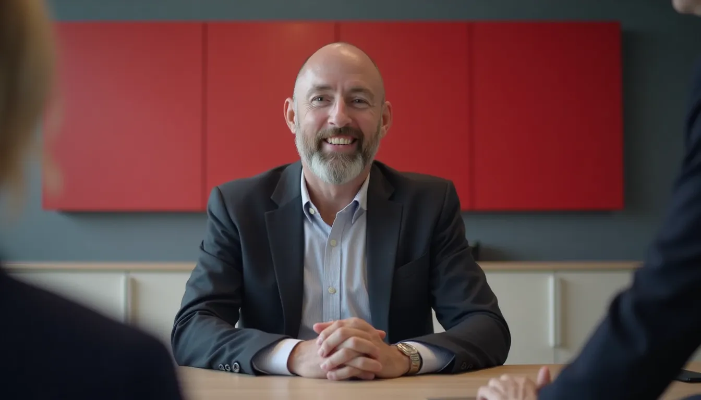

The initial meeting with a prospect often starts as an impersonal interaction—a web inquiry or a phone call. These methods lack the tangible connection of a physical presence. Inviting the prospect to your office for a face-to-face meeting changes everything. Sitting in the boardroom, sharing a coffee, and looking across the table humanizes the interaction and brings your company to life. This is the foundation for building trust and a lasting relationship.

<!--endintro-->

### Why Face-to-Face Matters

First impressions are everything. In the first 30 to 60 seconds, people form emotional judgments based on your physical presence, your office environment, your smile, and your demeanor. These subconscious judgments create a “gut feel” that influences the entire sales process.

Meeting in person gives you the opportunity to:

- Showcase your professionalism and expertise through body language and environment.
- Build a human connection that can’t be replicated through screens or emails.
- Establish your brand by immersing prospects in your company culture and values.

### Best Practices for a Strong First Impression

1. **Schedule the Meeting at Your Office**
   - Invite the client to your space if possible. Your office environment—clean, organized, and welcoming—reflects your company’s brand and values.
   - Use the boardroom for the meeting to set a professional tone.

2. **Be Welcoming**
   - Offer hospitality, such as a coffee or tea, to make the prospect feel comfortable and at ease.
   - Provide a warm greeting and engage in light conversation to build rapport before diving into business.

3. **Focus on Connection**
   - Maintain eye contact and smile genuinely. These subtle gestures build trust and demonstrate your confidence.
   - Listen actively and ask thoughtful questions to show you value their time and perspective.

### The Ripple Effect of a Good First Meeting

A strong initial impression can make subsequent interactions smoother and more productive. The client’s positive perception of you and your company will often persist throughout the relationship, setting the stage for successful collaboration.

::: greybox
You’ve received a web inquiry from a potential client. Instead of setting up a quick video call, you invite them to your office for a face-to-face meeting. They walk into a professional, well-organized space, are warmly greeted, and sit down for a productive conversation. The client leaves impressed, feeling confident in their decision to work with you.
:::
::: good
Figure: Good example - A face-to-face meeting builds trust and sets a positive tone for the relationship.
:::

By prioritizing in-person initial meetings, you not only foster stronger connections but also set the foundation for successful long-term relationships with your clients.

