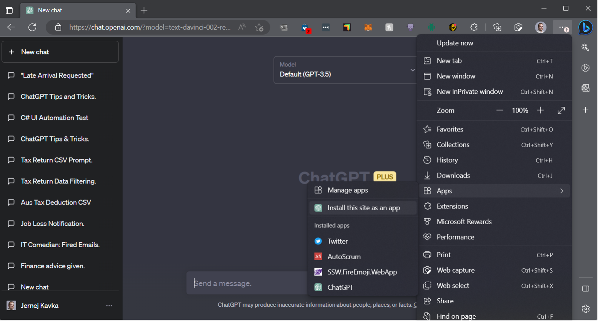
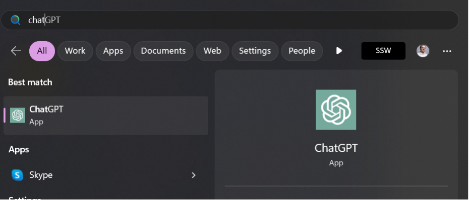
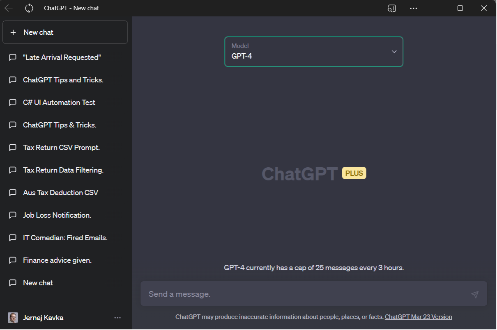

Adding ChatGPT as an app on your Windows, Android, or iOS device can be extremely useful for a number of reasons.

For example, you can use ChatGPT to ask questions, seek advice, or just have a casual chat whenever you need it. Whether you're looking for information on a specific topic, need help with a task, or simply want to pass the time, ChatGPT is always available to assist you with its intelligent responses.

<!--endintro-->

Furthermore, ChatGPT is constantly learning and improving its abilities, which means that the more you use it, the more personalized and accurate its responses will become. With ChatGPT as an app on your device, you can have an intelligent and reliable virtual assistant at your fingertips, ready to help you with whatever you need, whenever you need it. So, whether you're a busy professional or just someone looking for a fun and engaging chatbot, adding ChatGPT as an app is a decision that you won't regret.

### How to install ChatGPT on Mobile
- Android - https://play.google.com/store/apps/details?id=com.openai.chatgpt
- iOS - https://apps.apple.com/us/app/chatgpt/id6448311069

### How to add ChatGPT as an Edge app:

