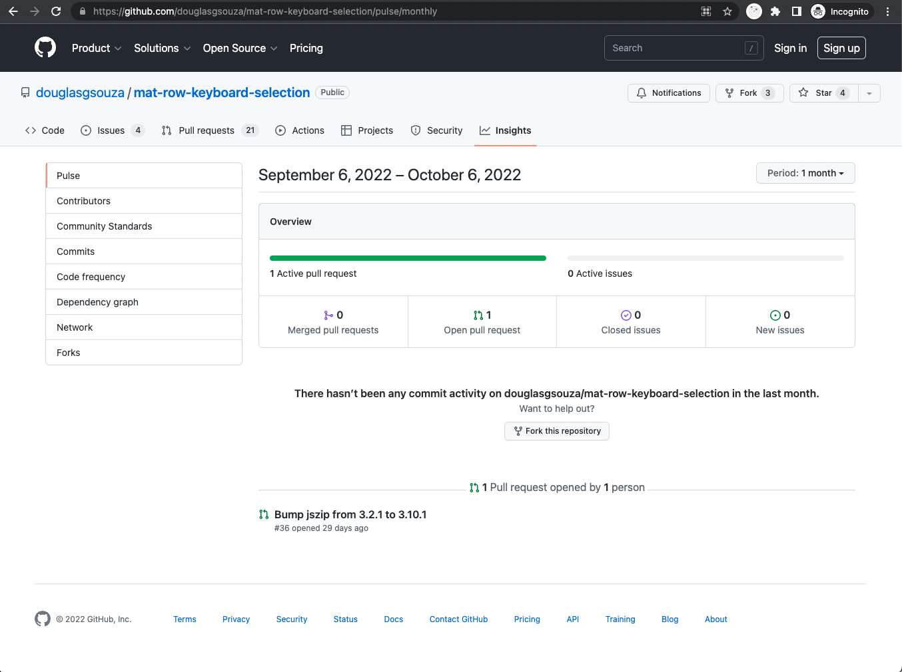
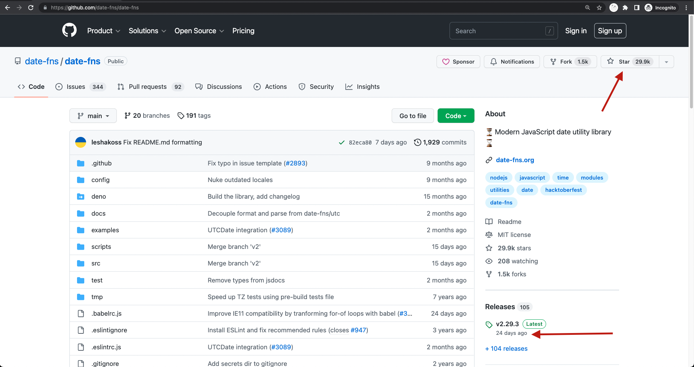
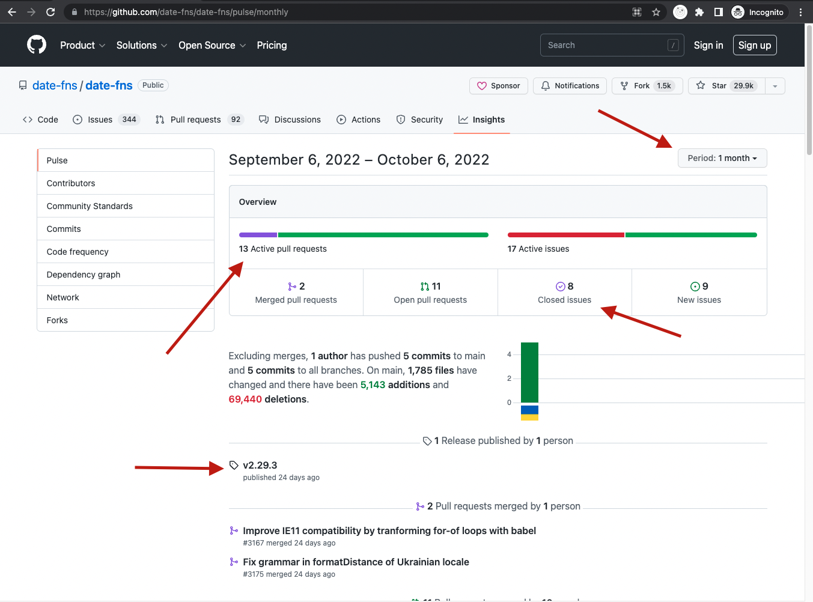
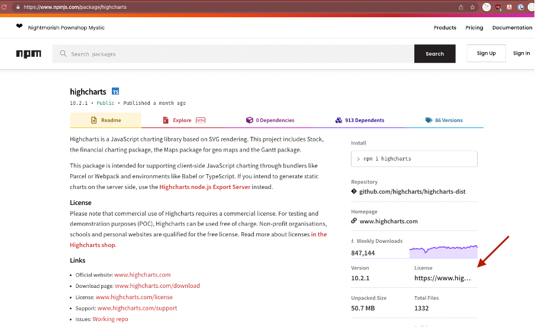
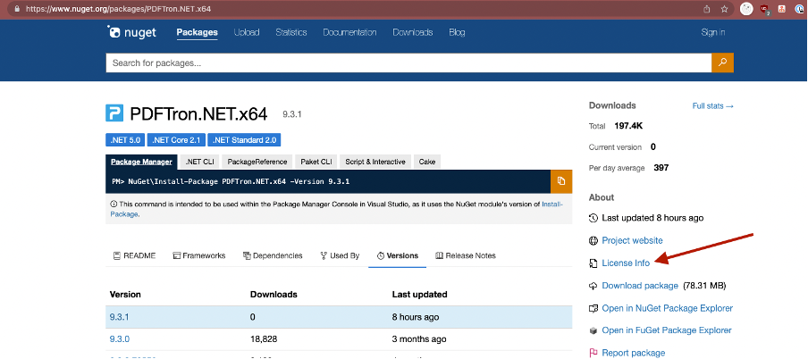
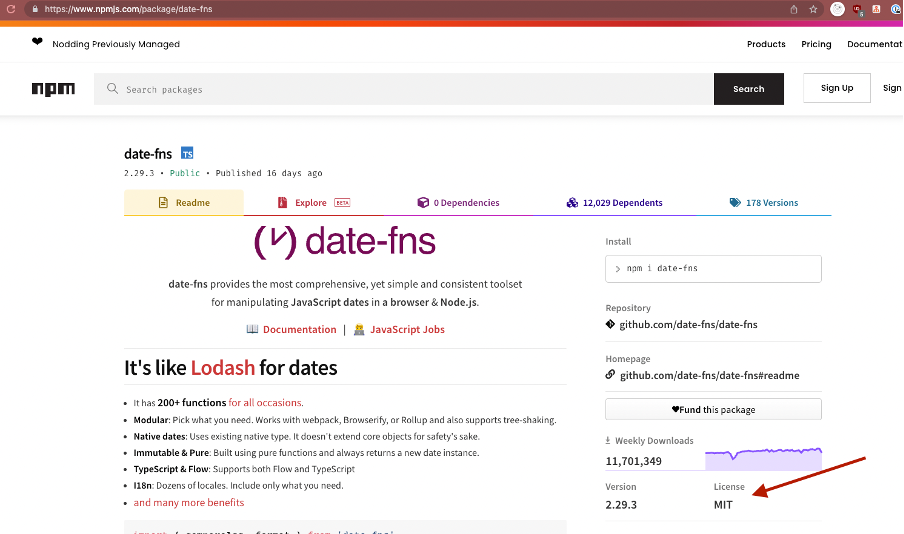
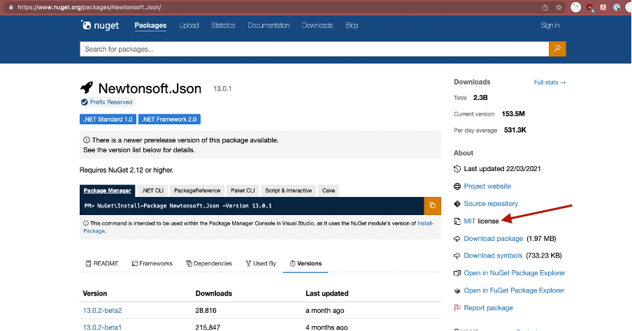

Efficient software developers don't reinvent the wheel and know the right libraries to use. Using an already existing and well-tested libraries will speed up development time.

However, there are scenarios where the libraries that you have integrated in a project brings overhead in the future. For example, the project is using a NuGet package that is no longer being maintained and does not support the latest .NET version. This forces the development team to refactor the code to use another library should they wish to use the latest version of .NET.

Looking for the right library can help to minimise the chances of a project hitting these scenarios. Here are some of the common things to check before installing a library.

Things to check:

### 1. Is it valuable?
Only install libraries that brings big value to the project. Avoid installing libraries for these kind of usage:

❌ Libraries for trivial functions (e.g. `is-odd` - checking if a number is odd or not)

❌ Installing multiple libraries with duplicate use-cases (e.g. installing two component libraries [Angular Material](material.angular.io/) and [NG-ZORRO Ant Design](ng.ant.design/docs/introduce/en))

Instead, look for these good usage candidates:

✅ One library for one use-case (e.g. one for component, one for authentication)

✅ Libraries providing complex or standard use cases that has been tested thoroughly (e.g. validating credit card number, validating email format).

### 2. Is it actively maintained?
Next thing to consider is the library’s lifespan. The last thing that we want is to integrate a library into our project to find out on next month that it is no longer supported.

Couple of things to check:

✅ High download count – Frequently used libraries are more likely to be supported longer.

✅ Recently updated – Checking the library’s last updated date is a good start to decide whether the library is actively maintained or not.

✅ Good maintainers profile – Libraries sponsored by big companies (e.g. Angular by Google) or established names would more likely to last longer than a library maintained by an unknown person.

✅ Low GitHub issues count – Many unresolved serious issues may be an indicator that the library is not actively maintained.

::: bad

:::

::: good

:::

::: good

:::

### 3. Is it compatible?
Most libraries are built only for a specific version of a runtime / framework that they are targeting to.

E.g. the npm library `@angular/material@14.2.3` is only targeted for Angular 14 and NuGet library `Microsoft.EntityFrameworkCore` `v6.0.7` only supports .NET 6.

This is important to make sure that the library is working as intended. 
Although some libraries can be installed and work on older framework versions, it’s a good idea to avoid being in this situation as this could introduce unintended bug which increases the overhead in debugging your code.

### 4. Is it high quality?
Next is to dive deep down into the details and check for the quality of the library itself.

Here are things to check:

✅ Maintainer's profile - A high profile maintainers with a good presence in the community or doing a lot of contribution is a good boost of confidence in the library.

✅ Presence of unit tests and good coverages - This improves our confidence that the code would less likely to break across versions

✅ Changelogs and versioning - Good changelogs between release enables developers to check for any potential breaking changes.

### 5. What is the licensing?
Not all libraries available on [npmjs](www.npmjs.com) and [NuGet](www.nuget.org) are free to use. Depending on the license provided with the library, it can range from a free-to-use to a paid license.
Always check the license associated with the package before deciding to use it in production. You can check of common available licenses here on [Choosealicense.com](www.choosealicense.com).

::: bad

:::

::: bad

:::

::: good

:::

::: good

:::

### 6. What are the bundle characteristics?
A huge benefit for client-side applications (Angular, React, or Blazor WASM) is to reduce the size of the code that a user needs to download (also known as bundles) to run our application. 
Installing and using many libraries can deteriorate this experience and increase the size of our application's bundle. 

#### JavaScript projects:
There are tools out there to help us figuring the cost of installing a library to our end bundle size (e.g. [BundlePhobia](www.bundlephobia.com) or [BundleJs](www.bundlejs.com)).

On top of this, we can also check for a library’s tree-shaking capability. Tree-shaking is a term commonly used on JavaScript which is a process to remove unused code from a library in the final bundle.
Unfortunately, there's no easy way to know if a library is tree-shakable other than to read the documentation and experimenting with tools such as [BundleJs](www.bundlejs.com) to see the final bundle size when importing just several items from the library.

#### .NET Projects:
Unfortunately, there are no tools available yet to check for bundle size for nuget packages.

To reduce the final build size, .NET provide a built in feature  [Trimmer](learn.microsoft.com/en-us/dotnet/core/deploying/trimming/trimming-options?pivots=dotnet-6-0), but these needs to be done carefully as apps that use reflection might not work as expected. [Read more about Trimmer here](learn.microsoft.com/en-us/aspnet/core/blazor/host-and-deploy/configure-trimmer?view=aspnetcore-6.0).

---

### Document the decision

* **Have a 2nd pair of eyes** - Lastly before deciding to install the library, check with another developer that are experienced in the scope of your project (e.g. look for a senior JavaScript developer's opinion if the project is an Angular project). Having a 2nd qualified person to agree with your decision is a good indicator that you are picking a good library.

* [Document the decision](document-discoveries) - Always keep track of the reasoning when developers decided to go with a particular library instead of another one. This helps future developers working on a project to maintain the project. Future developers will have a better context and will be able to make a better decision should there be any situational or business requirement changes.
