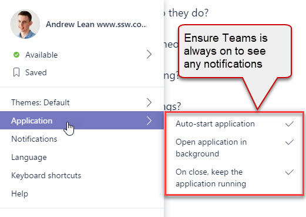

[Dealing with distractions](/_layouts/15/FIXUPREDIRECT.ASPX?WebId=3dfc0e07-e23a-4cbb-aac2-e778b71166a2&TermSetId=07da3ddf-0924-4cd2-a6d4-a4809ae20160&TermId=d65f17a0-2354-4793-9481-7dc2eea0e559) is a fundamental rule to a successful project. Microsoft Teams is a great way to get distracted. Following these options helps you to minimize message distractions:

1. Turn on at start-up - With the application always on your desktop, there is no reason for alerts to be sent to your email or phone
2. Disable email alerts - this [reduces bloat in your task list](/_layouts/15/FIXUPREDIRECT.ASPX?WebId=3dfc0e07-e23a-4cbb-aac2-e778b71166a2&TermSetId=07da3ddf-0924-4cd2-a6d4-a4809ae20160&TermId=4ebaa676-4599-4be1-b4ee-55427dba91bf)

<!--endintro-->
<dl class="image">&lt;dt&gt;&lt;/dt&gt;<dd>Figure: Open options (select image in the bottom right) | Notifications</dd></dl><dl class="image">&lt;dt&gt; &lt;/dt&gt;<dd> Figure: Set settings to "Only show in feed" so distracting phone and email alerts aren't sent</dd></dl><dl class="image">&lt;dt&gt;&lt;/dt&gt;<dd> Figure: In Microsoft Teams turn on "Auto-start application". Suggestion to Microsoft: Make this the default </dd></dl>
### Related Rules 

* If you run Outlook to manage the email you should also [minimize Outlook distractions](/_layouts/15/FIXUPREDIRECT.ASPX?WebId=3dfc0e07-e23a-4cbb-aac2-e778b71166a2&TermSetId=07da3ddf-0924-4cd2-a6d4-a4809ae20160&TermId=7d2b06ad-cac7-4afc-b7af-0552fe30b6ac).
* If you use Skype too you should also [minimize Skype distractions](/_layouts/15/FIXUPREDIRECT.ASPX?WebId=3dfc0e07-e23a-4cbb-aac2-e778b71166a2&TermSetId=07da3ddf-0924-4cd2-a6d4-a4809ae20160&TermId=6650d51f-dc2c-47d4-a779-2dc4f8a3c8c9).
