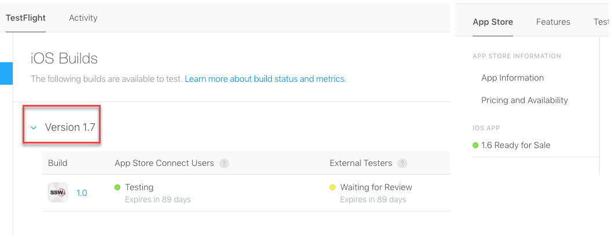
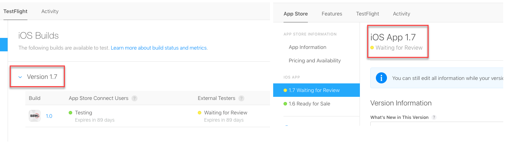

​A common approach is to submit your app to Testflight, wait for user feedback, then submit for App Store release. The problem with this approach is that your release cycle can be significantly impacted by Apple's review schedule. App Store and Testflight reviews can be very quick, but can also take up to 3 weeks! 
 

 <excerpt class='endintro'></excerpt> 

A better process is to submit your build for Testflight and Release simultaneously. 
<h3 class="ssw15-rteElement-H3">​​Steps: </h3><ol><li>Upload your build to App Store Connect.</li><li>When automated processing is completed (scanning of the assemblies usually takes less than an hour), you will receive an email confirmation, open Testflight and submit for approval. </li><li>Immediately, prepare your app for submission to the App Store (by completing the appropriate metadata, e.g. new features or fixes in this version). <strong>    Important</strong>: Set to Manual Release so that your app does not get automatically released untested. </li><li>If you are using external or public users, your build must be approved by Apple for testing. <strong>    Note:</strong> If you are using internal testers only (App Store Connect users), they can begin testing immediately.​ </li><li>Once both your App Store and Testflight builds have been approved, get a Test Pass via the Test Please process - see <a href=/do-you-conduct-a-test-please-internally-and-then-with-the-client>Rules to Successful Projects: Do you conduct a "test please" internally and then with the client?​</a> ​ <strong>    Tip for Mid-Sprint Releases</strong>: If its an internal app, you can accelarate the Test Please process by asking someone with an iPhone to test straight away via Testflight. <strong>    Tip for End of Sprint Releases: </strong>Get the Testflight and Release submissions approved in preparation for your Sprint Review. You can then demo your release to the Product Owner and be ready to release your Product Increment after the Sprint Review.  </li><li>You can now release your app as soon as you are ready. In App Store Connect click Release to make your latest build publicly available in the App Store.    </li></ol><dd class="ssw15-rteElement-FigureBad">​​Figure: Bad Example - v1.7 is "Waiting for Review" in Testflight but only v1.6 is submitted to the App Store. This can introduce delays of 3 weeks. </dd>
​​​​ 

  
<dd class="ssw15-rteElement-FigureGood">​​Figure: Good Example - v1.7 has been submitted to Testflight and App Store at the same time - also "Waiting for Review", but your build will be ready to release as soon as testing has passed  </dd>
 

