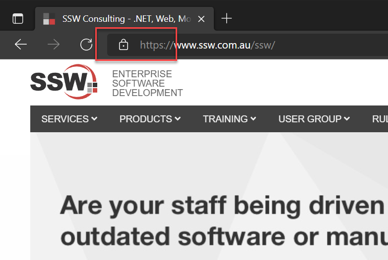

When entering your password (or any other sensitive information, including credit card numbers) into a website, you must make sure that your connection to that website is encrypted. The route your password takes from your web browser to the website is quite a journey – it starts by being broadcast across your wireless network (note your wireless network should be encrypted, but its best not to rely on that). It then goes to a router, then to your internet service provider (ISP), then anywhere across the world before getting to its destination. It can be intercepted at any step along this journey.

<!--endintro-->

Check that the connection is encrypted. Look for the padlock symbol in your browser (usually in the address bar)

Also ensure the address starts with **https://** and NOT **http://** (without the s).

Finally, you may sometimes see the address bar turn green. This indicates that the owner of the website has gone through extended verification (EV). EV is not necessary for security, however EV is part of an encryption certificate, so if you see it, then it’s an indication that the connection is encrypted.

::: good

:::