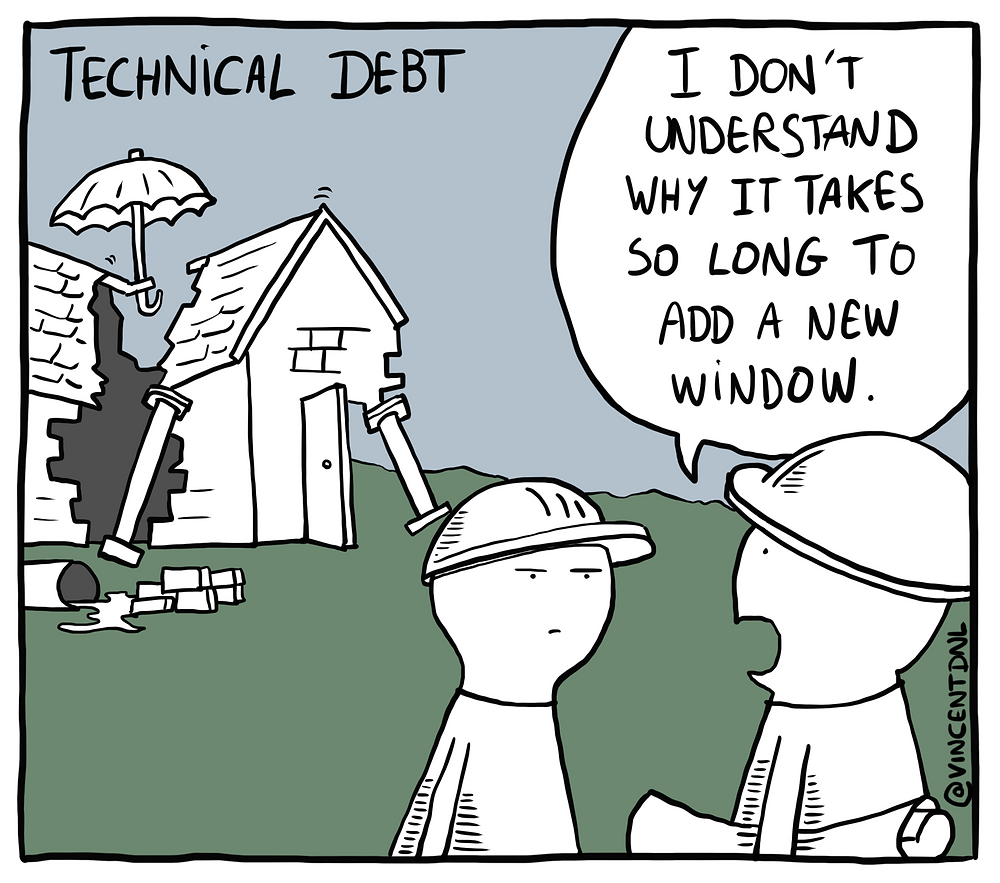

In the world of software development, adding new features to large projects can be a complex task, fraught with complications. Doing it the right way requires a strategic approach that balances new development, technical debt, and overall project health. To maintain this balance, follow the principle of "Just Enough Refactoring."

<!--endintro-->

In a large project, you add a feature without taking the time to clean up any of the existing, related technical debt (the "crap"). While you may feel like you're moving quickly at first, this approach can lead to significant issues down the line. As the technical debt accrues, the complexity and cost of changes increase, and the stability of your project suffers.

::: bad 

:::

Conversely, in a large project, you decide to add a feature and take on the herculean task of trying to fix all the existing technical debt at once. While this might feel like a responsible approach, it's akin to "boiling the ocean" - a task so huge that it's likely to stall progress and overwhelm your team. This approach can lead to significant project delays and could also introduce new bugs as you touch parts of the system that aren't directly related to the new feature.

::: bad 

:::

::: greybox
The recommended approach involves a balance. When adding a feature to a large project, address the technical debt that directly surrounds or is impacted by that feature. By doing so, you reduce the overall technical debt incrementally, without stalling progress. This approach ensures that the parts of the codebase most in need of attention receive it when they're being changed, which increases the stability and maintainability of your project over time.
:::

::: good 
Good example - Just Enough Refactoring 
:::

::: info
A tool like [Dotnet-Affected](https://github.com/leonardochaia/dotnet-affected) can help in identifying the dependencies and impact of changes. This can be particularly useful for large projects or monorepos, helping you understand what's affected by your changes and where you should focus your refactoring efforts. Just remember to refactor "just enough" – tackle the technical debt that directly impacts your new feature, but avoid trying to fix everything at once.
:::
