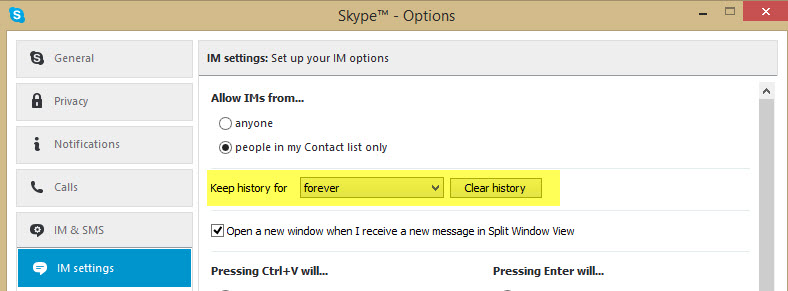

IM conversations often can be as important as emails, if not more so, because they are usually only used for high priority issues or issues that need to be resolved now. Therefore, it is very important to keep history of all your IM conversations. They can often be used as a reference point, or as a digital log of all the important issues that have been discussed. In fact, you can be guaranteed that you will want to revisit something you have discussed before with other employees.

<!--endintro-->

Once this option is turned on, Skype will keep the last 3 months of your conversation history in the app - just scroll up to see older conversations. For conversations older than 3 months, the conversations are saved in a file called main.db in your Skype folder. The location of this folder depends on your OS and which version of Skype you are running. Visit [the Skype FAQ](https://support.skype.com/en/faq/FA392/where-can-i-find-my-conversation-history-in-skype-for-windows-desktop-and-what-can-i-do-with-it#4) to find out more. 

The only exception to this rule of course is when you're using a public computer, in which case privacy and security issues arise by keeping IM history on that computer.
