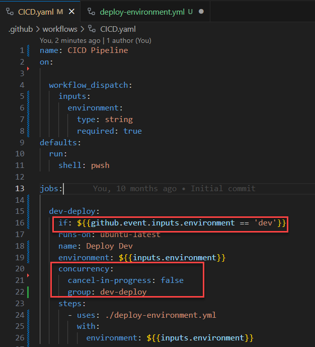
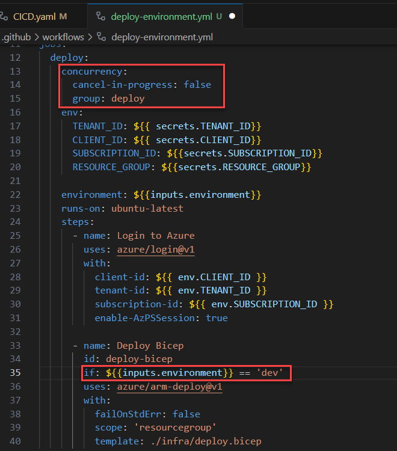

When designing CI/CD workflows, it's essential to maintain clarity and simplicity. This ensures that your pipelines are easy to understand, modify, and troubleshoot.

<!--endintro-->

Scattering conditional actions and concurrency controls across multiple sub-pipelines or jobs can lead to confusion. It becomes challenging to track the flow, and potential bottlenecks or errors might be overlooked.

::: bad

:::

Keep all conditional actions and concurrency controls centralized in the main pipeline. This provides a clear overview of the workflow and makes it easier to manage and optimize the pipeline's performance.

By adhering to this rule, you ensure that your CI/CD workflows remain streamlined, efficient, and easy to manage.