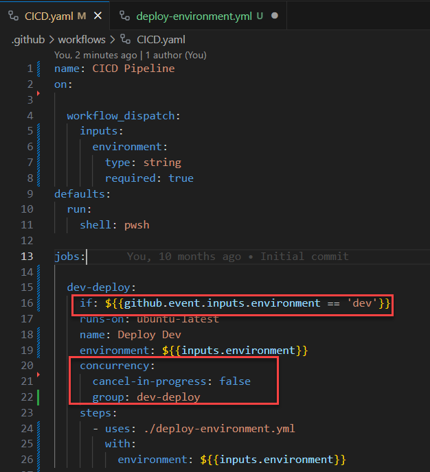
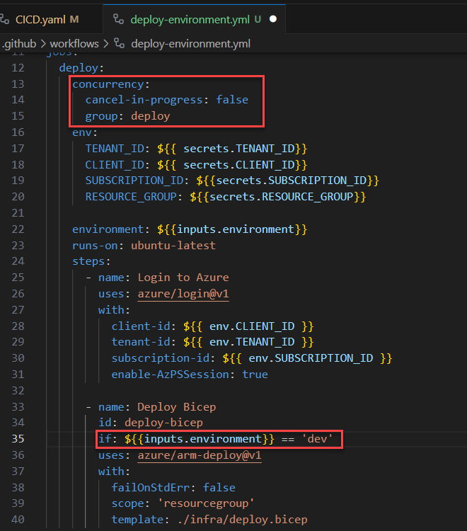
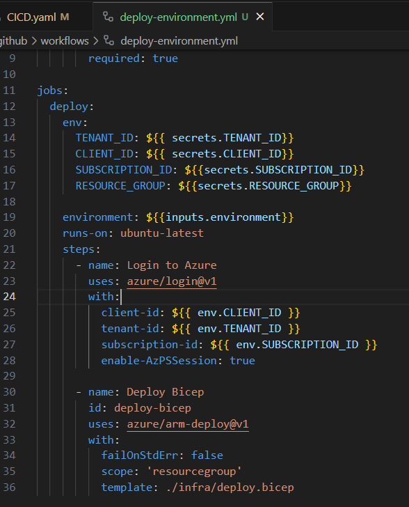

When designing CI/CD workflows, it's essential to maintain clarity and simplicity. This ensures that your pipelines are easy to understand, modify, and troubleshoot.

<!--endintro-->

Scattering conditional actions and concurrency controls across multiple sub-pipelines or jobs can lead to confusion. Tracking the flow becomes challenging, and potential bottlenecks or errors might be overlooked.

::: bad

:::

Adding further conditionals or concurrency controls to the workflows adds no value. The workflow still only runs in the "dev" environment and operates within its own concurrency group. However, when changes are made to the more visible workflow (CICD.yaml), it's less obvious that changes are needed in the called workflow.

::: bad

:::

Centralize all conditional actions and concurrency controls in the main pipeline. This approach provides a clear overview of the workflow, making it easier to manage and optimize the pipeline's performance.

::: good

:::

::: good

:::

Of course, there are occasional circumstances where a called workflow must contain a conditional. However, these instances should be limited and documented thoroughly to ensure clarity and maintainability.

By adhering to this rule, you ensure that your CI/CD workflows remain streamlined, efficient, and easy to manage.
