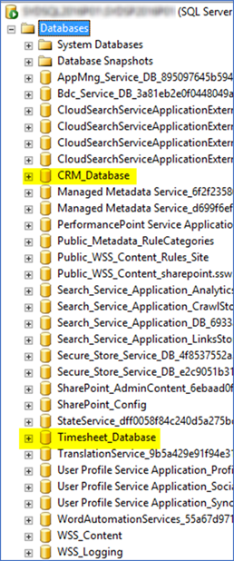

Because SharePoint server will create quite a few databases, it’s easier to manage them in a separate SQL instance rather than mixing it with other system’s databases: 

 <excerpt class='endintro'></excerpt> 
<dl class="badImage"><dt>​​​</dt><dd>Bad example - mixed with other systems' database</dd></dl><dl class="goodImage"><dt>​​​</dt><dd>Good example - SharePoint related databases are in a separate SQL instance from other systems' databases​ </dd></dl>

