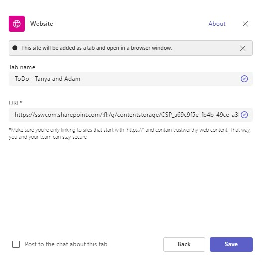
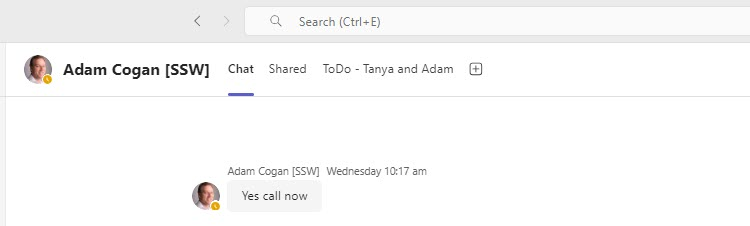

Things move fast at work, so staying on top of your tasks is key. With Microsoft Loop right in your Teams tab, you can easily keep track of what you’re doing and update your manager whenever needed.

<!--endintro-->

`youtube: https://www.youtube.com/watch?v=itWQ8d-9giQ`
**Video: Efficient Task Management with Microsoft Loop Tutorial | Tanya Leahy | SSW Rules (3 mins)**

::: bad  

:::

::: good  

:::

## Using Loop in Teams

1. **Create a Shared Workspace:** In Microsoft Loop, create a shared workspace to organize and manage your tasks collaboratively
2. **Add a Loop Component:** Inside the shared workspace, create a new Loop component where you will track your tasks
3. **Enter Tasks:** Record all your tasks, deadlines, and priorities into the Loop component
4. **Add Loop to Teams Tab:** Open your Teams Chat | Tabs | + | Search 'Website' | Paste in Loop Workspace URL | Rename tab, e.g. ToDo - Tanya and Adam

    ::: img-medium
    
    :::
    
    ::: img-medium
    
    :::
  
5. **Keep It Updated:** Regularly update the status of your tasks in the Loop component to keep it current
6. **Instant Access:** Ensure the Teams Tab with the Loop component is easily accessible so you can quickly pull it up when your Manager calls

By maintaining an organized and up-to-date task list in Loop, you will always be prepared to provide a comprehensive status update to your Manager. This not only helps in staying productive but also demonstrates your organizational skills and reliability.
