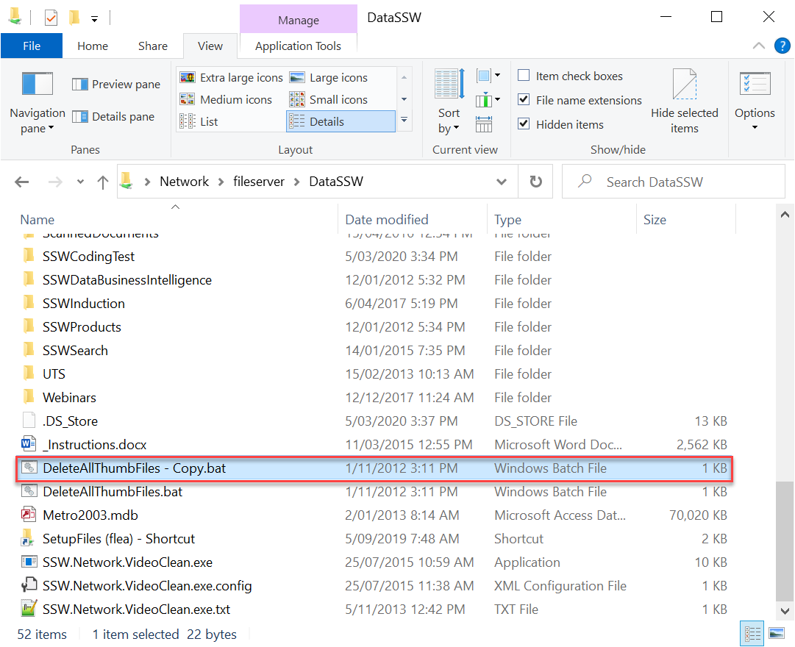
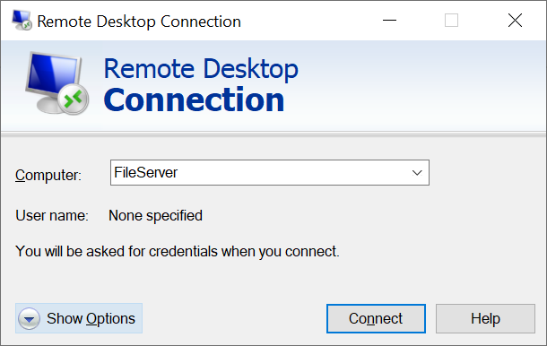
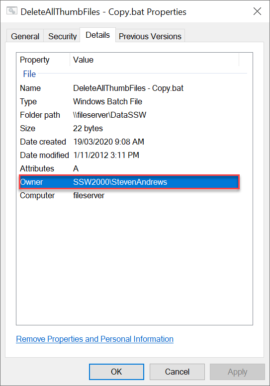
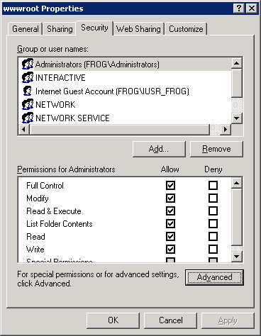
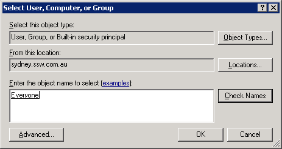
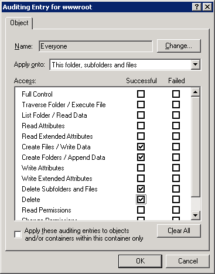
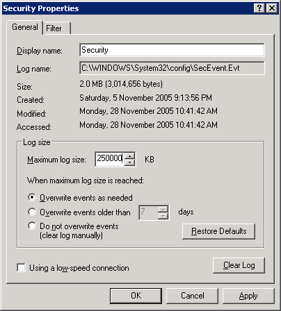
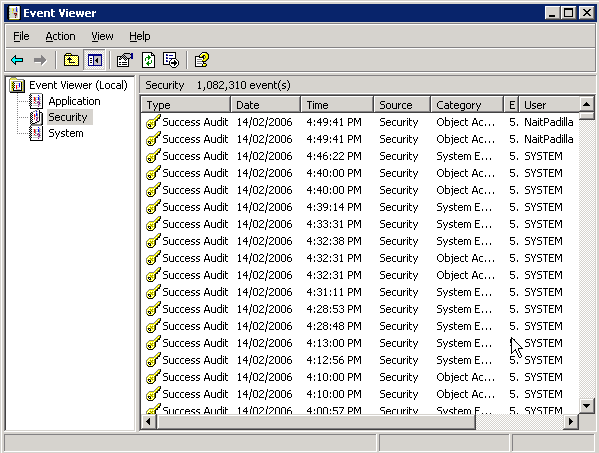
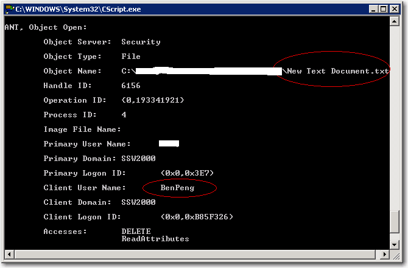

How often do you find files on your network file server that clearly shouldn't be there? Developers are notorious for creating temporary files and littering your file system with them. So how can you identify exactly who created or modified the file, and when?

<!--endintro-->

The easiest way is to configure  **Windows file auditing** .

Thankfully, Windows Server come with built-in file auditing. Any changes create and delete can be logged to your system event log. Here's how to set it up.

### How to implement auditing on your file server

1. Terminal Server into the file server
2. In Windows Explorer, locate the directory you want to configure logging for (e.g.  **C:\Inetpub\wwwroot** for logging changes to your website files)
3. Select  **Security** tab |  **Advanced** 
     
4. Click the  **Auditing** tab
5. Select the users whose usage you want to monitor (usually all users, so select  **Everyone** ) 
     
6. Select what you want to monitor. For best performance, we only tick the options in shown in the figure below - there's no need to log when someone opens a file. 
     
7. Click  **OK** and  **OK** again to apply the changes. The process may take some time depending on the number of subfolders and files selected.
   Now you need to configure the system event log.
8. Open  **Control Panel-&gt;Administrative Tools-&gt;Event Viewer**
9. Right-click the  **Security** node and Control Panel | Administrative Tools | Event Viewer
10. Right-click the sure  **Overwrite events as needed** is checked 
      

### Checking who created the file

Now test to see if auditing is working.

1. On the server, create a file called "test.aspx" somewhere in the path that is being audited
2. Open  **Control Panel-&gt;Administrative Tools-&gt;Event Viewer**
3. Select the  **Security** node, and notice the entries that have been created. They will have a similar format to the figure below. 
     

That's all! It is also great for finding out who accidentally deleted files from the file system.

Furthermore, we can dump the event log to an Access or SQL Server database to make it easier to handle. Here is how to do it:

* [Download the scripts](https://github.com/SSWConsulting/SSW.Rules.Content/raw/main/rules/keep-your-file-servers-clean/DumpEventLog2Db.zip): one for Access database and the other for SQL Server.
* Find and change the strEventDBConn variable to your connection string, also, modify strEventDB and tblEvents variable to your database name and table name.
* Write down the names of the servers to monitor in EventHosts.txt.

Done, now you need only double-click to start it.

