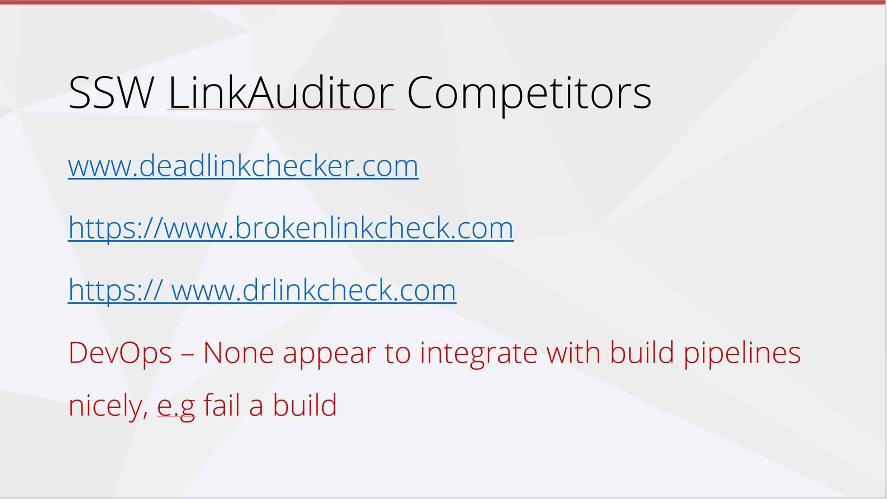
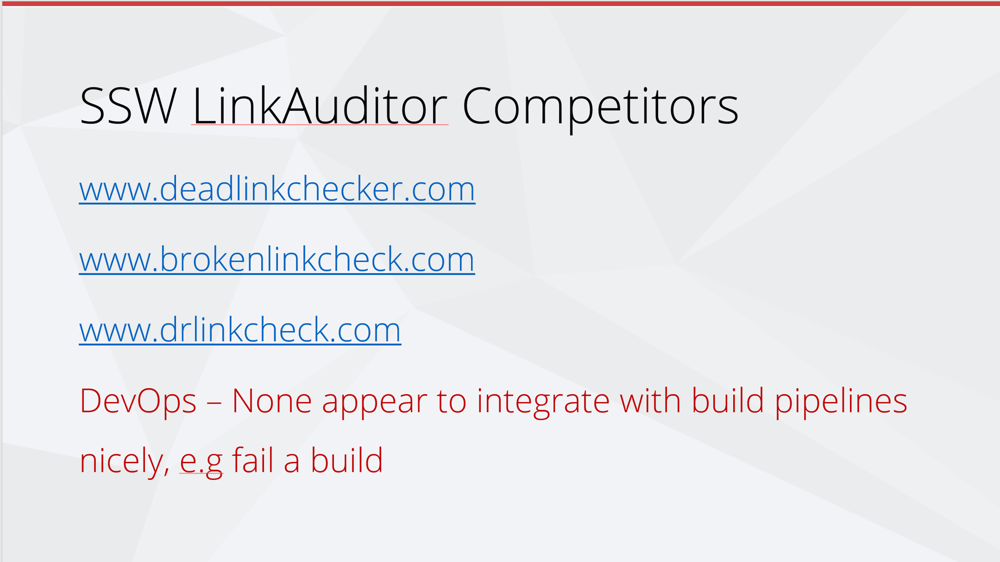

When you’re sending emails, or pinging someone in Teams, your URLs should be as clean as possible. This ensures that they are easy to read, and it is more aesthetically pleasing. 

::: greybox

**Note:** URLs have become increasingly cluttered with the introduction of tracking information. 

For example, companies use CampaignIDs on their website to track customer activities and information, but when you’re sharing the URLs, it is better to make them clean and readable. So, delete everything after the question mark (including the CampaignID suffix).
:::

::: email-template  
|          |     |
| -------- | --- |
| To:      | Adam |
| Cc:      | YYY |
| Bcc:     | ZZZ |
| Subject: | Purchase please - new hand dryer |  
::: email-content  
### Hi Adam,  

Here is the link to the new hand dryer that you wanted to see:

Vortex Hand Dryer, Super Quiet motor, 3 Years Warranty OZ2100 
$184 (no electrical installation required – plugs in – for the men's bathroom upstairs)
https://www.ozwashroom.com.au/hand-dryer-285?campaignid=1683143023&adgroupid=62945164502&keyword=&device=c&gclid=Cj0KCQjw--GFBhDeARIsACH_kdbAtHf_smGug0NCviYbZvW_9uGLXLT1LjheMQ-bpBOOtqcD5ln3Uz0aAjS6EALw_wcB

Best,
Dave

:::  
:::  
::: bad
Figure: Bad example - Dirty URL with superfluous information
:::

::: email-template  
|          |     |
| -------- | --- |
| To:      | Adam |
| Cc:      | YYY |
| Bcc:     | ZZZ |
| Subject: | Purchase please - new hand dryer |  
::: email-content  
### Hi Adam,  

Here is the link to the new hand dryer that you wanted to see:

Vortex Hand Dryer, Super Quiet motor, 3 Years Warranty OZ2100 
$184 (no electrical installation required – plugs in – for the men's bathroom upstairs)
https://www.ozwashroom.com.au/hand-dryer-285

Best,
Dave

:::  
:::  
::: good
Figure: Good example – Clean URL that is easy to read and looks much better
:::

### Presentations

Remember to remove the 'https://' from URLs in your presentations. It keeps the content cleaner and more readable.

<!--endintro-->

::: bad  
  
:::

::: good  
  
:::
