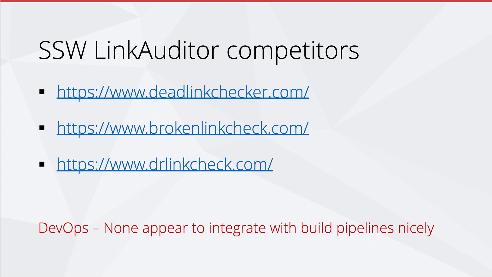
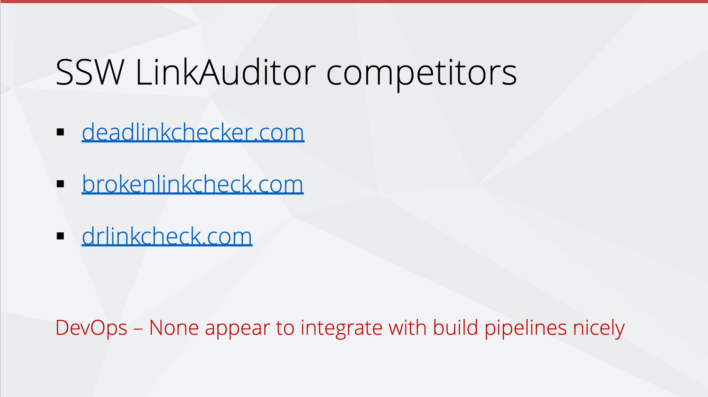

When you’re sending emails, or pinging someone in Teams, your URLs should be as clean as possible. Having no extra noise ensures that they are easy to read, and it is more aesthetically pleasing.

<!--endintro-->

::: info
**Note:** URLs have become increasingly cluttered with the introduction of CampaignIDs (used to track customer activities and other information). When you're sharing the URLs, it is better to make them as clean and readable as possible... so delete everything after the question mark (including the CampaignID suffix).
:::

## Tip #1 - Break a line before URLs

It is also a good idea to [break a line before an URL](/format-new-lines/#urls), improving its readability.

::: email-template

| | |
| -------- | --- |
| To: | Bob |
| Subject: | Purchase please - New hand dryer |
::: email-content

### Hi Bob

Here is the link to the new hand dryer that you wanted to see:

**Vortex Hand Dryer, Super Quiet motor, 3 Years Warranty** - $184
(no electrical installation required – plugs in – for the men's bathroom upstairs) <https://www.ozwashroom.com.au/hand-dryer-285?campaignid=1683143023&adgroupid=62945164502&keyword=&device=c&gclid=Cj0KCQjw--GFBhDeARIsACH_kdbAtHf_smGug0NCviYbZvW_9uGLXLT1LjheMQ-bpBOOtqcD5ln3Uz0aAjS6EALw_wcB>

Best,
Dave

:::
:::
::: bad
Figure: Bad example - Dirty URL with superfluous information
:::

::: email-template

| | |
| -------- | --- |
| To: | Bob |
| Subject: | Purchase please - New hand dryer |
::: email-content

### Hi Bob

Here is the link to the new hand dryer that you wanted to see:

**Vortex Hand Dryer, Super Quiet motor, 3 Years Warranty** - $184
(no electrical installation required – plugs in – for the men's bathroom upstairs)
[ozwashroom.com.au/hand-dryer-285](https://www.ozwashroom.com.au/hand-dryer-285)

Best,
Dave

:::
:::
::: good
Figure: Good example – Clean URL on a new line is easy to read and looks much better
:::

::: info
**Note:** Make sure to [place the URL on a new line](/format-new-lines/#urls) to reduce clutter and improve readability.
:::

## Tip #2 - Remove `https://` and `www`

For **presentations** and **videos** (i.e. (lower thirds](/video-editing-terms/#3-lower-third)), it's especially important to keep URLs cleaner. Remember to always remove `https://www.` from links. It keeps the slides cleaner and more readable.

::: bad

:::

::: good

:::
