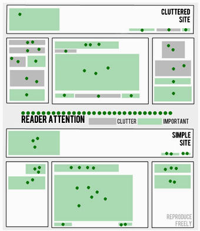

Not only do we try to keep our designs clean and simple without too many images,          we also try to minimise the number of words. If something can be revised to make          it cleaner and simpler, we will always do it. A lack of superfluous words means          your readers don't get bored and will stick around longer.

<!--endintro-->

  

Web minimalism and simplicity means emphasizing what is essential and important           to your readers. Remove every non-essential or unimportant element. Readers only           have so much attention to give, if you present them with less they will have more           attention to give to each element.

### Benefits of Simple Design

* Pages load faster
* Clearer and easier to scan
* Easy to navigate
* Quicker to design (more profitable)
* Quicker to build
* Quicker to redesign
* Easier to maintain
* Easier to make work on different browsers
