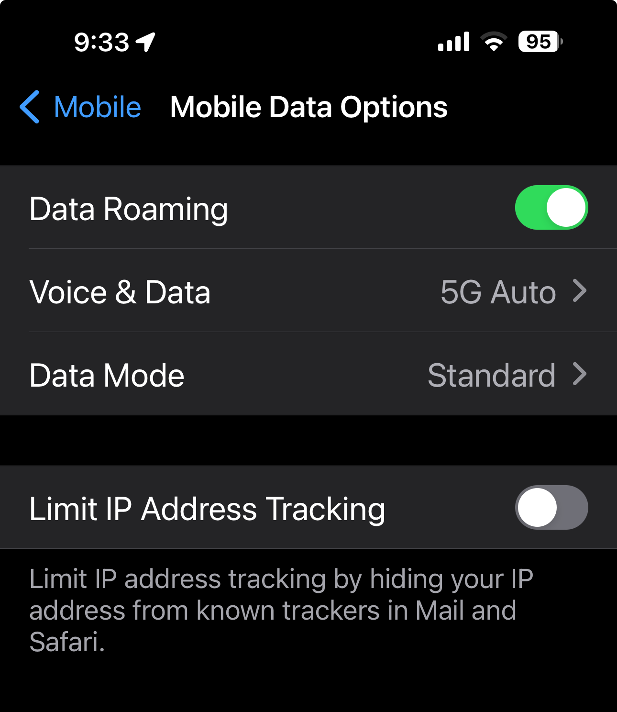
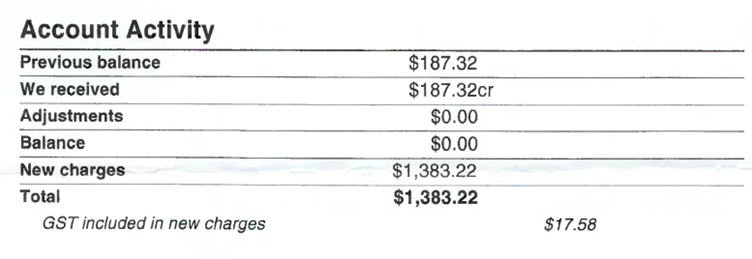
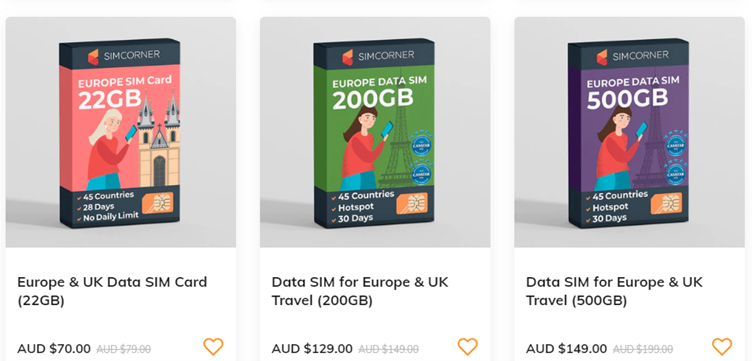

Ensuring seamless connectivity during international travel is a crucial consideration, especially on business trips. While obtaining a roaming package from your service provider is a common solution, you might face exorbitant bills upon returning home.

The question arises: _How can one stay connected without the risk of huge bills?_

Roaming package eg. Telstra are a big $ money waste

<!--endintro-->

There are few options:

### Option A. Dual-SIM Phone with a Travel Sim (recommended)

If you travel overseas a lot, it may be worth considering owning a dual-SIM phone. This is highly recommended due to its cost-effectiveness, easy management, and enhanced security.

Take the popular iPhone as an example, which offers an eSIM and a physical SIM slot. You can convert your primary mobile number to an eSIM and keep the physical SIM slot for your travel SIMs.

- ✅ Usually data-only, cheap, and easy to acquire
- ✅ Can be pre-purchased weeks before you go – it is only activated once you connect it to the network
- ✅ Your mobile number is still active when overseas (with your eSIM) and the data usage stays with the travel SIMs

Note: Sometimes it is better to use a eSIM travel app e.g. <https://roamless.com/>
You can buy data and use it in 165 countries without changing SIM cards.

### Option B. Portable 4G Router

Invest in a device, insert the local travel SIM, and share the Wi-Fi with multiple users and devices.

- ✅ Cost-effective, preserves your phone's battery life and is perfect for single-SIM phones
- ❌ You will need to carry an extra device
- ❌ You may miss out on free Wi-Fi – the router is connected by Wi-Fi so you cannot connect to others, for example, hotels

### Option C. Roaming package eg. Telstra

Rely on your current roaming service, for example, Telstra charges $10 per day for 1 GB of data and $10 per extra GB. Some other carriers may offer more competitive packages.

- ✅ Straightforward, with no additional purchases, and a pay-as-you-go structure
- ❌ Expensive and occasionally poor internet connectivity

---

## Summary

Each option has its pros and cons, allowing you to tailor your connectivity strategy based on your preferences and specific travel needs.

Travel SIMs usually offers better user experience if you spend more data.

- ✅ Travel SIMs are usually much cheaper than roaming packages
- ✅ They are prepaid and disposable
- ✅ It can be a perfect combination with your roaming service to have enough cheap data to use and make calls from your roaming service. Of course, you will have your regular mobile connected as well, so you won’t miss the important calls and text messages
- ❌ Often limited to data only and will expire after a certain period

::: info
**Tip:** Travelling to China can be different due to the Great Firewall of China 🧱, which prevents you from accessing Google, Facebook, Teams etc.

It may require a VPN to access these services from a local network. But the travel SIMs purchased outside of China or roaming mobile data packages have no restrictions because your IP is where the SIMs are registered.
:::
