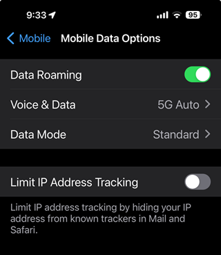

Staying connected when traveling internationally is super important, especially for business trips. While grabbing a roaming package from your mobile provider is a popular choice, it can sometimes lead to a shockingly high bill when you get back home.

The question arises: _How can one stay connected without the risk of huge bills?_

<!--endintro-->

Roaming packages (e.g. Telstra) are a big $ money waste.

::: bad

:::

::: bad

:::

There are a few options:

## Option A. Dual-SIM - Travel SIM/eSIM (✅ recommended)

If you travel overseas a lot, it may be worth considering owning a dual-SIM phone. This is highly recommended due to its cost-effectiveness, easy management, and enhanced security.

Take the popular iPhone as an example, which offers multiple eSIMs and a physical SIM slot. You can keep your primary mobile number and add an eSIM for your travel SIMs.

**✅ Pros:**

* Usually cheap, and easy to acquire and setup
* Can be pre-purchased weeks before you go – it is only activated once you connect it to the network
* Your mobile number is still active when overseas and the data usage stays with the travel eSIMs
* You can share your data with other devices using Mobile Hotspot
* Disposal of a used e-SIM can be done easily with a few clicks

**Note:** Sometimes it is better to use a eSIM travel app, e.g. [mobimatter.com](https://mobimatter.com)> or [roamless.com](https://roamless.com). You can buy an eSIM and add it to your mobile directly, which is available in most countries.

::: greybox
**Tip:** To make it work, you need to switch your SIM from “Primary” (Home number) to “Travel SIM”

Go to Settings | Mobile| Sims | Select “Travel SIM".
:::

## Option B. Portable 4G Router

Invest in a device, insert the local travel SIM, and share the Wi-Fi with multiple users and devices.

**✅ Pros:**
* Cost-effective, preserves your phone's battery life and is perfect for single-SIM phones

**❌ Cons:**
* You will need to carry an extra device
* You may miss out on free Wi-Fi – the router is connected by Wi-Fi so you cannot connect to others, for example, hotels

## Option #C. Roaming package e,g,. Telstra

Rely on your current roaming service, for example, Telstra charges $10 per day for 1 GB of data and $10 per extra GB. Some other carriers may offer more competitive packages, such as Felix (TPG), which provides a 4 GB package that is valid for 365 days for $25.

**✅ Pros:**
* Straightforward, with no additional purchases, and a pay-as-you-go structure
* Good for a short trip

**❌ Cons:**
* Expensive and occasionally poor internet connectivity

---

## Summary

Each option has its pros and cons, allowing you to tailor your connectivity strategy based on your preferences and specific travel needs.

Travel SIMs are a prepaid, disposable option that's **usually cheaper** than roaming for high data use, offering a good user experience and a great complement to your main number, though they can sometimes be data-only and non-rechargeable.

::: good

:::

::: info
**Tip:** Travelling to China can be different due to the Great Firewall of China 🧱, which prevents you from accessing Google, Facebook, Teams etc.

It may require a VPN to access these services from a local network. But the travel SIMs purchased outside of China or roaming mobile data packages have no restrictions because your IP is where the SIMs are registered.
:::
