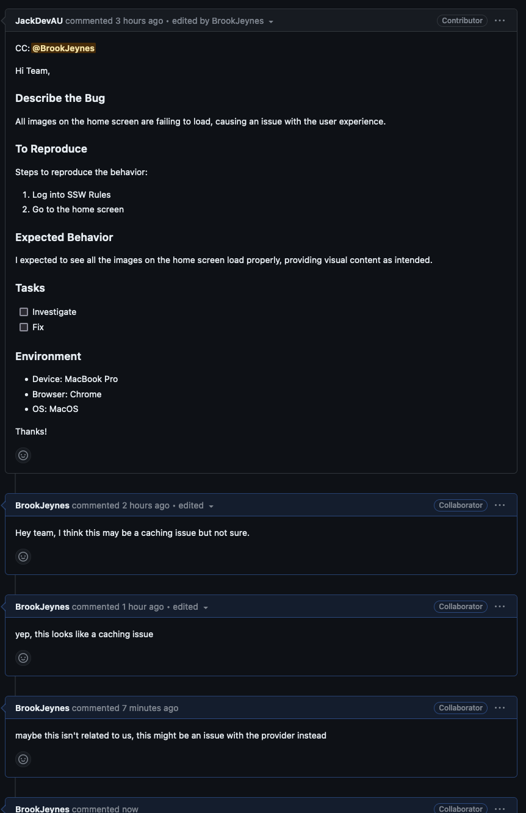
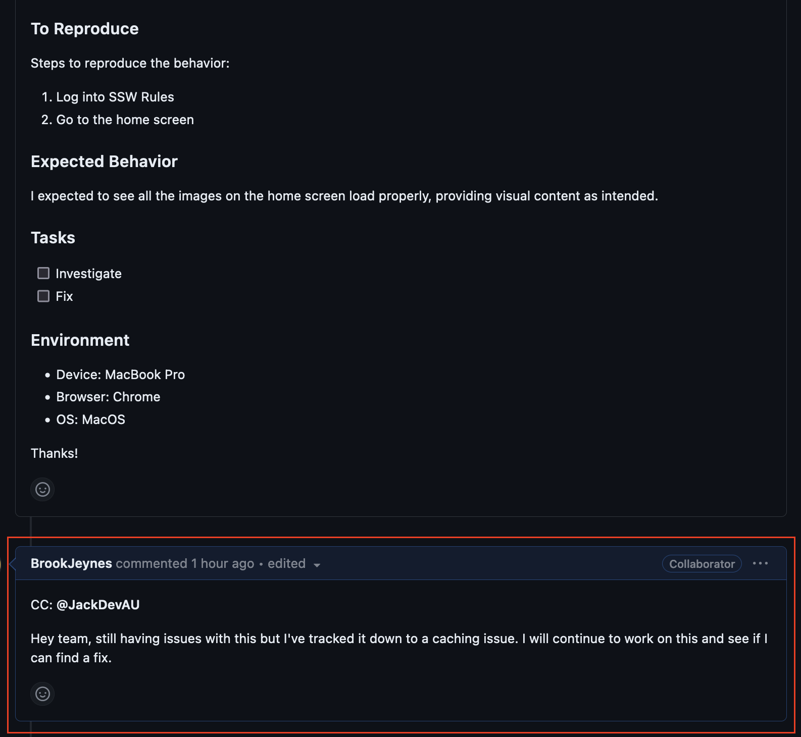
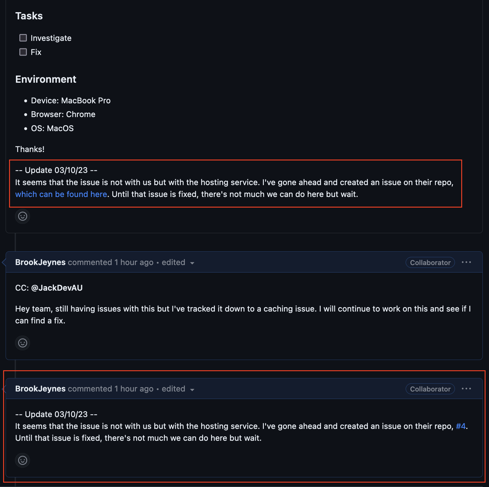
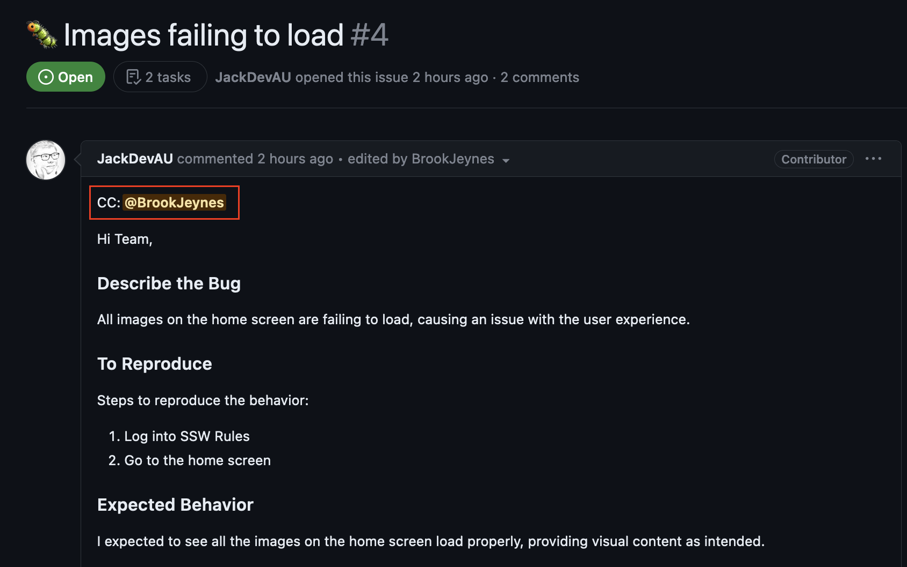
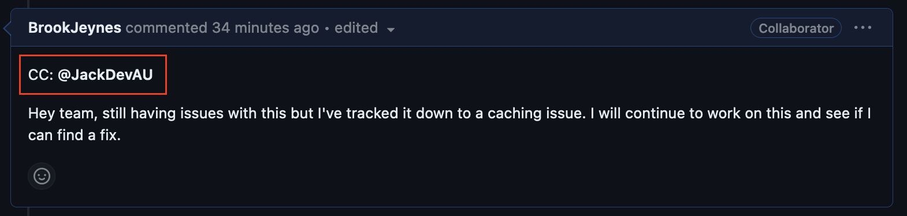

As PBIs evolve, it's common for their initial descriptions to become outdated or for significant developments to occur that must be recorded for the benefit of the entire team.

<!--endintro-->

Whenever a PBI necessitates an update, the team should add a comment to the issue, detailing the change or event. 

::: bad

:::

::: good

:::

In cases where an update is long standing or important, it should be appended to the bottom of the issue description. This update must include the date it was made, serving as a chronological record of changes. In addition, a comment should be left on the issue thread to inform team members that significant information has been added to the issue.

Re-assigning the PBI? You don't need to comment or change the PBI description. GitHub and Azure DevOps both track this via the "Assignees" field and audit changes.

::: good

:::

It's also important to CC anyone who may need to see this additional information.

::: good

:::

::: good

:::
